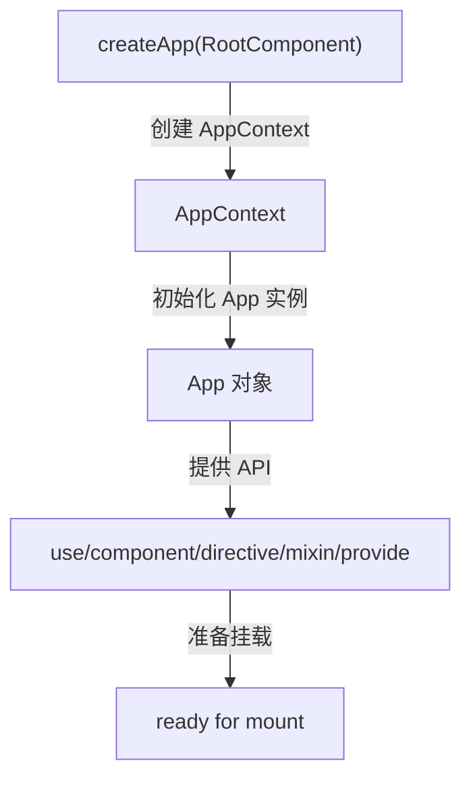
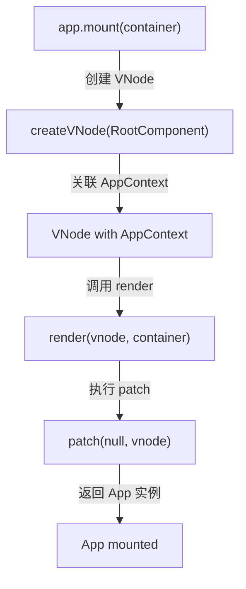
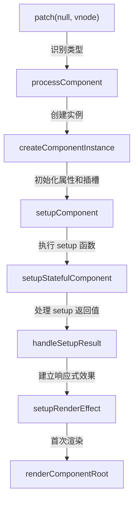
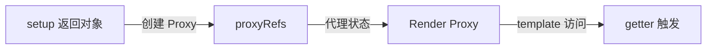
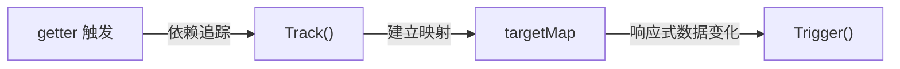
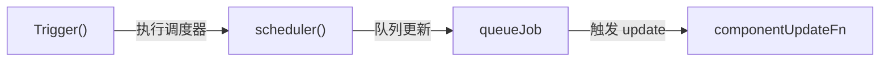
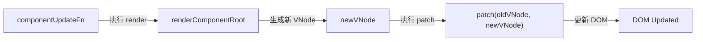
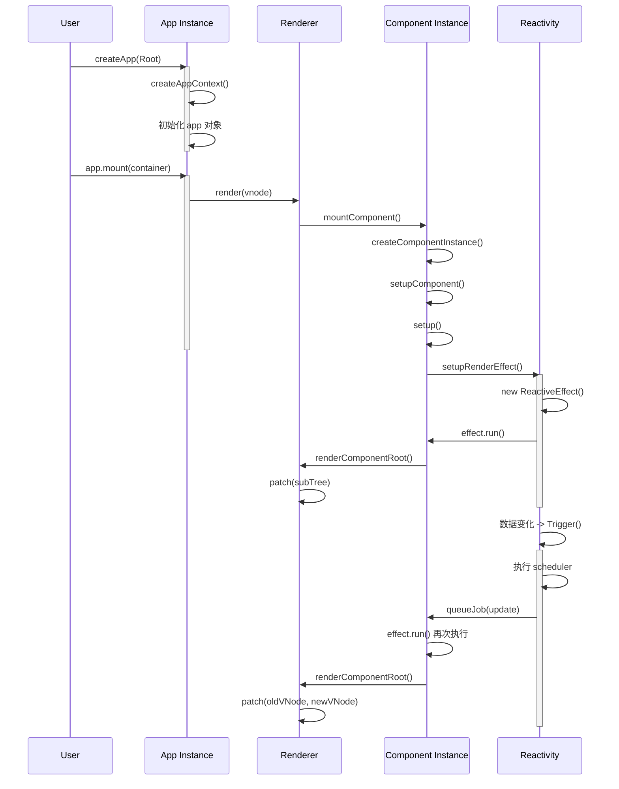

# Vue 3 启动机制概览

本文档是 Vue 3 启动和初始化流程的完整指南。从应用创建到组件挂载，再到响应式系统的建立，详细阐述了 Vue 3 的核心架构。

## 核心概念

### AppContext - 应用全局上下文

AppContext 是 Vue 应用的全局上下文对象，存储了应用级别的配置和状态。每个应用实例都有一个对应的 AppContext。

```typescript
interface AppContext {
  app: App; // 应用实例
  config: AppConfig; // 应用配置对象
  mixins: ComponentOptions[]; // 全局混入选项
  components: Record<string, Component>; // 全局注册组件
  directives: Record<string, Directive>; // 全局注册指令
  provides: Record<string | symbol, any>; // provide() 提供的值
  optionsCache: WeakMap<Component, MergedComponentOptions>; // 组件选项缓存
  propsCache: WeakMap<Component, NormalizedPropsOptions>; // Props 定义缓存
  emitsCache: WeakMap<Component, ObjectEmitsOptions>; // Emits 定义缓存
}
```

**关键点：**

- WeakMap 确保当组件被垃圾回收时，缓存自动清理，避免内存泄漏
- props/emits 缓存提升归一化性能到 O(1)
- provide/inject 系统通过 AppContext 实现全局依赖注入

### VNode - 虚拟节点

VNode 是 Vue 的虚拟 DOM 表示。它是一个轻量级的 JavaScript 对象，描述了 UI 应该如何渲染。通过虚拟 DOM
的对比（diff）和更新（patch），Vue 可以高效地管理真实 DOM。

```typescript
interface VNode {
  type: VNodeTypes; // VNode 类型（元素、组件、文本等）
  props: Record<string, any> | null; // 属性和事件监听器
  children: VNodeArrayChildren; // 子 VNode 或文本内容
  el: Element | null; // 对应的真实 DOM 元素
  appContext: AppContext | null; // 所属应用的上下文
  component: ComponentInternalInstance | null; // 组件实例（组件 VNode 时）
  shapeFlag: number; // VNode 形状标志，用于类型判断
  patchFlag: number; // 补丁标志，优化 diff 算法
  // ...
}
```

**关键点：**

- VNode 是连接模板、逻辑和 DOM 的桥梁
- shapeFlag 使用位标志高效存储 VNode 类型信息
- patchFlag 指导 diff 算法只更新必要的属性

### ComponentInternalInstance - 组件内部实例

ComponentInternalInstance 是 Vue 组件运行时的内部实例。它包含了组件的状态、生命周期、响应式系统等所有必要信息。

```typescript
interface ComponentInternalInstance {
  // ===== 基础信息 =====
  uid: number; // 组件唯一标识符
  vnode: VNode; // 组件对应的 VNode
  type: ConcreteComponent; // 组件定义对象
  parent: ComponentInternalInstance | null; // 父组件实例
  root: ComponentInternalInstance; // 根组件实例
  appContext: AppContext; // 所属应用的上下文

  // ===== 响应式系统 =====
  scope: EffectScope; // 效果作用域，隔离响应式
  effect: ReactiveEffect | null; // 当前活跃的响应式效果
  update: () => void; // 组件更新函数

  // ===== 状态管理 =====
  data: Data; // data() 返回的状态
  props: Data; // 父组件传入的 props
  attrs: Data; // 非 props 属性（通过 $attrs 访问）
  slots: Slots; // 插槽内容
  setupState: Data; // setup() 返回的响应式对象

  // ===== 生命周期钩子 =====
  bm: LifecycleHook | null; // beforeMount 钩子
  m: LifecycleHook | null; // mounted 钩子
  bu: LifecycleHook | null; // beforeUpdate 钩子
  u: LifecycleHook | null; // updated 钩子
  um: LifecycleHook | null; // unmounted 钩子

  // ===== 状态标志 =====
  isMounted: boolean; // 是否已挂载
  isUnmounted: boolean; // 是否已卸载
}
```

**关键点：**

- ComponentInternalInstance 包含 120+ 个属性，完整管理组件生命周期
- EffectScope 隔离了每个组件的响应式副作用
- accessCache 优化了属性访问性能

### ReactiveEffect - 响应式效果

ReactiveEffect 是 Vue 响应式系统的核心。它建立了数据和副作用之间的关系，当数据变化时自动执行关联的副作用。

```typescript
interface ReactiveEffect {
  fn: () => void; // 副作用函数
  scheduler?: (effect: ReactiveEffect) => void; // 调度函数
  scope?: EffectScope; // 所属的效果作用域
  active: boolean; // 是否活跃
  deps: Set<Dep>[]; // 依赖的响应式数据集合
  // ...
}
```

**关键点：**

- 响应式系统通过 Track 和 Trigger 两个操作实现依赖追踪和通知
- 调度器允许自定义副作用执行时机（如批量更新）
- EffectScope 允许一次性停止所有副作用

## 完整启动流程

### 1. 应用创建阶段（createApp）



**处理步骤：**

1. 创建 AppContext 对象，存储全局配置
2. 初始化 App 实例，绑定所有方法
3. 注册全局配置（混入、组件、指令、provide）
4. 准备就绪，等待 mount() 调用

### 2. 应用挂载阶段（mount）



**处理步骤：**

1. 从根组件创建 VNode
2. 将 AppContext 关联到根 VNode
3. 调用 render 函数开始渲染
4. patch 函数将虚拟 DOM 转换为真实 DOM

### 3. 组件初始化阶段（Component Initialization）



**处理步骤：**

1. **createComponentInstance**: 创建 ComponentInternalInstance，初始化 120+ 个属性
2. **setupComponent**: 初始化 props、slots，为 setup 做准备
3. **setupStatefulComponent**: 创建渲染代理、执行 setup 函数
4. **handleSetupResult**: 处理 setup 的返回值（对象、函数或 Promise）
5. **setupRenderEffect**: 创建 ReactiveEffect，建立响应式系统

### 4. 响应式渲染阶段（Reactive Rendering）









**关键机制：**

- **Track（依赖追踪）**: 在 render 函数执行时，自动收集访问的响应式数据
- **Trigger（依赖通知）**: 数据变化时，通知所有依赖该数据的副作用
- **Scheduler（调度）**: 批量收集多个更新，合并成一次 render

---

## 启动流程时序图



---

## 关键执行流程

### 模式 1: 初始挂载流程

```
createApp(RootComponent)
  ↓
createAppContext()
  ↓
App 初始化
  ↓
app.mount(container)
  ↓
createVNode(RootComponent)
  ↓
render() 调用
  ↓
patch(null, vnode)
  ↓
mountComponent()
  ↓
createComponentInstance()
  ↓
setupComponent()
  ↓
setupStatefulComponent()
  ↓
setup(props, context)
  ↓
handleSetupResult()
  ↓
setupRenderEffect()
  ↓
effect.run() - 首次执行
  ↓
renderComponentRoot()
  ↓
patch(null, subTree) - 挂载 DOM
  ↓
组件挂载完成 (mounted)
```

### 模式 2: 响应式更新流程

```
响应式数据变化 (count.value++)
  ↓
Trigger() - 执行依赖通知
  ↓
scheduler() - 调度器执行
  ↓
queueJob(instance.update) - 将更新加入队列
  ↓
收集更多变化（批处理）
  ↓
flushJobs() - 处理队列
  ↓
componentUpdateFn() - 执行更新函数
  ↓
renderComponentRoot() - 执行 render
  ↓
patch(oldVNode, newVNode) - diff and patch
  ↓
DOM 更新完成 (updated)
  ↓
浏览器渲染新 DOM
```

### 模式 3: Props 到 Template 的数据流

```
Props（来自父组件）
  ↓
initProps()
  ↓
instance.props
  ↓
setup(props, context) 函数
  ↓
setup 返回对象
  ↓
proxyRefs() - 自动解包 ref
  ↓
instance.setupState
  ↓
Render Proxy - 代理合并
  ↓
<template> 访问 this.xxx
  ↓
renderComponentRoot()
  ↓
返回 VNode
```

---

## 核心优化机制

### 1. WeakMap 缓存

```typescript
// AppContext 中的缓存
optionsCache: WeakMap<Component, MergedComponentOptions>;
propsCache: WeakMap<Component, NormalizedPropsOptions>;
emitsCache: WeakMap<Component, ObjectEmitsOptions>;
```

**优势：**

- 自动垃圾回收：组件被销毁时，缓存自动清理
- O(1) 查询性能：无需遍历或计算
- 防止内存泄漏：不需要手动清理缓存

### 2. accessCache - 属性访问优化

```typescript
// ComponentInternalInstance
accessCache: Record<string, number | undefined>;

// 使用场景
// 第一次访问 this.count 时
accessCache['count'] = 0; // 0 表示在 setupState 中
// 第二次访问 this.count 时
// 直接从 accessCache 获取位置，跳过代理 handler 的多重判断
```

**性能提升：**

- 首次访问：遍历 setupState、props、data 等
- 后续访问：直接命中缓存，性能提升 10+ 倍

### 3. pauseTracking / resetTracking

```typescript
// setup 执行时暂停依赖追踪
pauseTracking();
const { setup } = Component;
if (setup) {
  const setupResult = setup(props, context);
}
resetTracking();

// 目的：
// - setup 中不应该追踪依赖（setup 只执行一次）
// - render 中应该追踪依赖（render 每次都需要响应）
```

### 4. 批量更新队列

```typescript
// 响应式更新时
count.value++; // → trigger() → scheduler() → queueJob()
message.value = ''; // → trigger() → scheduler() → queueJob()
flag.value = true; // → trigger() → scheduler() → queueJob()

// 结果：只有 1 次 update，不是 3 次
// queueJob 自动去重，同一个更新任务只会被加入一次
```

### 5. ShapeFlags - VNode 类型标志

```typescript
const ShapeFlags = {
  ELEMENT: 1, // 001
  FUNCTIONAL_COMPONENT: 1 << 1, // 010
  STATEFUL_COMPONENT: 1 << 2, // 100
  TEXT_CHILDREN: 1 << 3, // 1000
  ARRAY_CHILDREN: 1 << 4, // 10000
  SLOTS_CHILDREN: 1 << 5, // 100000
};

// 使用位运算判断 VNode 类型，性能优于 instanceof 或 typeof
if (vnode.shapeFlag & ShapeFlags.COMPONENT) {
  // 是组件 VNode
}
```

### 6. PatchFlags - 更新优化

```typescript
const PatchFlags = {
  TEXT: 1, // 只需更新文本
  CLASS: 1 << 1, // 只需更新 class
  STYLE: 1 << 2, // 只需更新 style
  PROPS: 1 << 3, // 只需更新属性
  FULL_PROPS: 1 << 4, // 需要完整 props 比对
};

// 编译器在模板编译时标记 patch 类型
_createVNode(
  'div',
  { id: id, class: 'static' },
  message,
  PatchFlags.TEXT, // 只有文本需要更新
);
```

---

## 文档导航结构

```
1-1-overview.md          ← 本文档：概览和核心概念
    ↓
1-2-createapp.md         ← createApp() 详解：应用创建
    ↓
1-2-mount.md             ← mount() 和 render：应用挂载和 patch 算法
    ↓
1-3-component-init.md    ← 组件初始化：从 VNode 到实例
    ↓
1-4-setup.md             ← setup() 函数：组合式 API 详解
    ↓
1-5-render-effect.md     ← 响应式系统：从数据到 DOM 更新
    ↓
1-6-architecture.md      ← 架构优化：缓存、标志、编译器优化
```

---

## 核心概念速查

| 概念                          | 作用             | 关键特性                               |
| ----------------------------- | ---------------- | -------------------------------------- |
| **AppContext**                | 应用全局上下文   | WeakMap 缓存、provide/inject、全局配置 |
| **VNode**                     | 虚拟 DOM 节点    | shapeFlag、patchFlag、与 DOM 映射      |
| **ComponentInternalInstance** | 组件运行时实例   | 120+ 属性、EffectScope、生命周期管理   |
| **ReactiveEffect**            | 响应式副作用     | 依赖追踪、调度器、自动更新             |
| **SetupContext**              | setup 执行上下文 | attrs、slots、emit、expose             |
| **Render Proxy**              | 渲染代理         | 属性访问优化、accessCache、统一访问    |
| **EffectScope**               | 效果作用域       | 隔离响应式、批量停止、防止泄漏         |

---

## 学习路径建议

### 初级理解（快速入门）

1. 阅读本文档的"核心概念"部分
2. 理解"完整启动流程"的 4 个阶段
3. 查看"关键执行流程"的 3 个模式

### 中级深入（完整理解）

1. 阅读 [1-2-createapp.md](./1-2-createapp.md) 了解应用创建细节
2. 阅读 [1-2-mount.md](./1-2-mount.md) 了解挂载和 patch 算法
3. 阅读 [1-3-component-init.md](./1-3-component-init.md) 了解组件初始化

### 高级精通（完全掌握）

1. 阅读 [1-4-setup.md](./1-4-setup.md) 了解 setup 函数细节
2. 阅读 [1-5-render-effect.md](./1-5-render-effect.md) 了解响应式系统
3. 阅读 [1-6-architecture.md](./1-6-architecture.md) 了解优化机制

---

## 常见问题

**Q: AppContext 和 app 实例的区别是什么？**
A: AppContext 存储全局配置状态，而 app 实例是暴露给用户的 API 对象。每个应用有一个 AppContext，但用户只能操作 app 对象。

**Q: 为什么需要 ComponentInternalInstance？**
A: VNode 是轻量级描述，ComponentInternalInstance 是重量级运行时实例，包含所有必要的状态管理、生命周期、响应式系统。

**Q: reactivity 系统是如何知道什么时候更新的？**
A: 通过 Track 和 Trigger 机制：render 函数执行时追踪依赖，数据变化时触发通知，调度器收集更新任务。

**Q: 为什么有 pauseTracking 和 resetTracking？**
A: setup 只执行一次，不应该追踪其中的数据访问。只有 render 函数需要追踪，以便响应数据变化。
