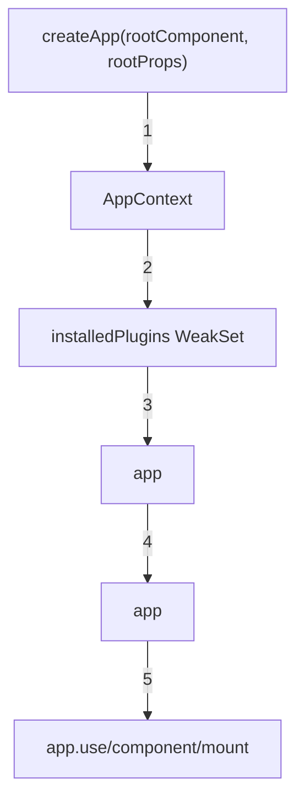

# createApp()
##
`createApp()`  Vue  App
---
##

---
##
###  1
```typescript
const context = createAppContext()
// createAppContext()
export function createAppContext(): AppContext {
  return {
    app: null as any,
    config: {
      isNativeTag: NO,
      performance: false,
      globalProperties: {},           //
      optionMergeStrategies: {},     //
      errorHandler: undefined,        //
      warnHandler: undefined,         //
      compilerOptions: {},            //
    },
    mixins: [],                        //  mixins
    components: {},                    //
    directives: {},                    //
    provides: Object.create(null),     // provide
    //  -  WeakMap
    optionsCache: new WeakMap(),       //
    propsCache: new WeakMap(),         //  props
    emitsCache: new WeakMap(),         //  emits
  }
}
```
** WeakMap**
```mermaid
graph LR
    A[""] -->|| B["WeakMap"]
    B -->|| C[""]
    A2[""] -->|| B
    Note over B:
```
-
-
- O(1)
###  2
```typescript
const installedPlugins = new WeakSet()
const pluginCleanupFns: Array<() => any> = []
let isMounted = false
```
****
- `installedPlugins`:
- `pluginCleanupFns`: app.unmount()
- `isMounted`:
###  3  App
```typescript
const app: App = {
  //
  _uid: uid++,                 //  ID
  _component: rootComponent,   //
  _props: rootProps,          //  props
  _container: null,           // mount
  _context: context,          //
  _instance: null,            // mount
  version: '3.5.x',           // Vue
  // config getter/setter
  get config() { return context.config },
  set config(v) { /*  */ },
  // API
  use,
  mixin,
  component,
  directive,
  mount,
  unmount,
  onUnmount,
  provide,
  runWithContext,
}
```
---
##  App  API
### 1. use(plugin, ...options) -
```typescript
use(plugin: Plugin, ...options: any[]) {
  //  1:
  if (installedPlugins.has(plugin)) {
    __DEV__ && warn(`Plugin has already been applied to target app.`)
    return app
  }
  //  2:
  installedPlugins.add(plugin)
  //  3:  install
  if (plugin && isFunction(plugin.install)) {
    plugin.install(app, ...options)
  } else if (isFunction(plugin)) {
    //
    plugin(app, ...options)
  }
  return app //  app
}
```
****
```typescript
//
const myPlugin = {
  install(app, options) {
    app.config.globalProperties.$myAPI = options.api
  }
}
//
app.use(myPlugin, { api: 'https://api.example.com' })
app.use(myPlugin) //
```
****
```mermaid
graph TD
    A["app.use(plugin, options)"] -->|| B{?}
    B -->|| C[""]
    B -->|| D[" installedPlugins"]
    D -->|| E{plugin.install?}
    E -->|| F[" plugin.install"]
    E -->|,| G{isFunction?}
    G -->|| H[" plugin"]
    G -->|| I[""]
    F -->|| J[" app"]
    H -->|| J
```
### 2. component(name, component?) -
```typescript
component(name: string, component?: Component): any {
  //  1:
  if (__DEV__) {
    validateComponentName(name, context.config)
  }
  //  2:
  if (!component) {
    return context.components[name]
  }
  //  3:
  if (__DEV__ && context.components[name]) {
    warn(`Component "${name}" has already been registered in target app.`)
  }
  context.components[name] = component
  return app //
}
```
****
```typescript
//
app.component('MyButton', MyButton)
//
const Button = app.component('MyButton')
```
### 3. directive(name, directive?) -
```typescript
directive(name: string, directive?: Directive) {
  //  1:
  if (__DEV__) {
    validateDirectiveName(name)
  }
  //  2: /
  if (!directive) {
    return context.directives[name] as any
  }
  if (__DEV__ && context.directives[name]) {
    warn(`Directive "${name}" has already been registered in target app.`)
  }
  context.directives[name] = directive
  return app
}
```
### 4. mixin(mixin) -  Mixin
```typescript
mixin(mixin: ComponentOptions) {
  if (__FEATURE_OPTIONS_API__) {
    if (!context.mixins.includes(mixin)) {
      context.mixins.push(mixin)
    } else if (__DEV__) {
      warn(`Mixin has already been applied to target app`)
    }
  }
  return app
}
```
### 5. provide(key, value) -
```typescript
provide(key, value) {
  if (__DEV__ && (key as string | symbol) in context.provides) {
    warn(
      `App already provides property with key "${String(key)}". ` +
      `It will be overwritten with the new value.`,
    )
  }
  context.provides[key as string | symbol] = value
  return app
}
```
****
```typescript
//
app.provide('API_URL', 'https://api.example.com')
//
const apiUrl = inject('API_URL')
```
### 6. mount(rootContainer) -
```typescript
mount(
  rootContainer: HostElement | string,
  isHydrate?: boolean,
  namespace?: boolean | ElementNamespace,
): ComponentPublicInstance {
  //
  if (!isMounted) {
    //  1:  VNode
    const vnode = app._ceVNode || createVNode(rootComponent, rootProps)
    vnode.appContext = context
    //  2:  namespace
    if (namespace === true) {
      namespace = 'svg'
    } else if (namespace === false) {
      namespace = undefined
    }
    //  3:  render
    if (isHydrate && hydrate) {
      hydrate(vnode as VNode<Node, Element>, rootContainer as any)
    } else {
      render(vnode, rootContainer, namespace)
    }
    isMounted = true
    app._container = rootContainer
    ;(rootContainer as any).__vue_app__ = app //
    //  4:
    if (__DEV__ || __FEATURE_PROD_DEVTOOLS__) {
      app._instance = vnode.component
      devtoolsInitApp(app, version)
    }
    //  5:
    return getComponentPublicInstance(vnode.component!)
  } else if (__DEV__) {
    warn(
      `App has already been mounted.\n` +
      `If you want to remount the same app, move your app creation logic ` +
      `into a factory function and create fresh app instances for each mount.`
    )
  }
}
```
### 7. unmount() -
```typescript
unmount() {
  if (isMounted) {
    //  1:
    callWithAsyncErrorHandling(
      pluginCleanupFns,
      app._instance,
      ErrorCodes.APP_UNMOUNT_CLEANUP,
    )
    //  2:  null
    render(null, app._container)
    //  3:
    if (__DEV__ || __FEATURE_PROD_DEVTOOLS__) {
      app._instance = null
      devtoolsUnmountApp(app)
    }
    delete app._container.__vue_app__
  }
}
```
### 8. runWithContext(fn) -
```typescript
runWithContext<T>(fn: () => T): T {
  const lastApp = currentApp
  currentApp = app
  try {
    return fn()
  } finally {
    currentApp = lastApp
  }
}
```
**** `inject()`  provide
---
##
```typescript
// 1.
const app = createApp(App, { theme: 'dark' })
// 2.
app.use(pinia)
app.use(router)
app.use(myCustomPlugin, { config: {...} })
// 3.
app.component('GlobalButton', GlobalButton)
app.component('GlobalModal', GlobalModal)
// 4.
app.directive('focus', {
  mounted(el) { el.focus() }
})
// 5.
app.config.errorHandler = (err, instance, info) => {
  console.error('Error:', err, info)
}
app.config.globalProperties.$http = axios
// 6.
app.provide('API_URL', process.env.VUE_APP_API_URL)
app.provide('theme', 'dark')
// 7.
app.mount('#app')
// 8.
// app.unmount()
```
---
##
```mermaid
graph LR
    A["createApp()"] -->|| B["App "]
    B -->|app.use| C[""]
    B -->|app.component| D[""]
    B -->|app.directive| E[""]
    B -->|app.provide| F[""]
    B -->|app.mount| G[""]
    C -->|plugin.install| H[" App"]
    D -->|context.components| H
    E -->|context.directives| H
    F -->|context.provides| H
    G -->|| I[""]
```
---
##
### 1. WeakMap
```typescript
//
//
optionsCache: new WeakMap()  // vs. Map ()
```
### 2.
```typescript
//  WeakSet
installedPlugins.has(plugin)  // O(1)
```
### 3.
```typescript
if (__DEV__) {
  validateComponentName(name, context.config)
}
//
```
---
##
- [mount()  render()](./1-2-mount.md) -
- [](./1-3-component-init.md) -
- [](./1-1-overview.md) -
