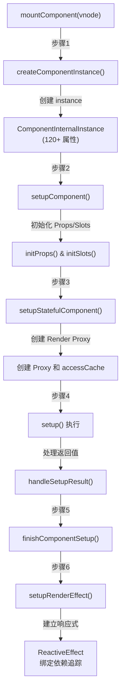

# 组件初始化

VNode 到 ComponentInternalInstance 的转化过程，包括 Props 初始化、Slots 处理和 setup() 函数执行。

## 完整初始化流程



## 步骤 1: createComponentInstance() - 创建组件实例

**调用关系**：

```
patch(null, vnode)
  → processComponent(vnode)
    → mountComponent(vnode)
      → createComponentInstance(vnode, parent, suspense)  ← 你在这里
        ↓ 返回 instance
      → setupComponent(instance)  ← 下一步
```

**核心职责**：将 VNode 转化为完整的运行时实例，初始化 120+ 个属性

### 函数签名和参数

```typescript
export function createComponentInstance(
  vnode: VNode, // 组件对应的 VNode
  parent: ComponentInternalInstance | null, // 父组件实例（null 为根组件）
  suspense: SuspenseBoundary | null, // Suspense 边界（异步组件）
): ComponentInternalInstance;
```

### 核心逻辑：3 个阶段

#### 阶段 A: AppContext 继承

```typescript
const type = vnode.type as ConcreteComponent;

// 这是关键！树形继承 AppContext
const appContext =
  (parent ? parent.appContext : vnode.appContext) || emptyAppContext;
```

**设计意图**:

- 根组件：从 `app.mount()` 时关联的 VNode 获取
- 子组件：从父组件继承
- 保证整个组件树共享同一个 AppContext

#### 阶段 B: 创建 instance 对象（120+ 属性）

```typescript
const instance: ComponentInternalInstance = {
  // ===== 基础信息 (5 个) =====
  uid: uid++, // 自增组件 ID
  vnode, // 关联的 VNode
  type, // 组件定义对象
  parent, // 父组件实例
  appContext, // 继承的全局上下文
  root: null!, // 根组件实例（待设置）

  // ===== VNode 管理 (2 个) =====
  next: null, // 下一个 VNode（更新时使用）
  subTree: null!, // 子树 VNode（首次渲染时设置）

  // ===== 响应式系统 (4 个) =====
  scope: new EffectScope(true /* detached */), // 隔离的响应式作用域
  effect: null!, // 当前响应式效果
  update: null!, // 更新函数（effect.run.bind）
  job: null!, // 调度器任务

  // ===== 渲染相关 (3 个) =====
  render: null, // render 函数
  proxy: null, // Render Proxy（this）
  withProxy: null, // SSR 专用 proxy

  // ===== 状态数据 (6 个) =====
  data: EMPTY_OBJ, // data() 返回的响应式对象
  props: EMPTY_OBJ, // 父组件传入的 props
  attrs: EMPTY_OBJ, // 非 props 属性（$attrs）
  slots: EMPTY_OBJ, // 插槽对象
  setupState: EMPTY_OBJ, // setup() 返回的响应式对象
  setupContext: null, // setup(props, context) 的 context

  // ===== 缓存和优化 (4 个) =====
  accessCache: null!, // 属性访问缓存（加速 this.property）
  renderCache: [], // 渲染缓存
  propsOptions: normalizePropsOptions(type, appContext), // Props 定义缓存
  emitsOptions: normalizeEmitsOptions(type, appContext), // Emits 定义缓存

  // ===== Emit 系统 (2 个) =====
  emit: null!, // 绑定的 emit 函数
  emitted: null, // 已发射的事件

  // ===== Props 默认值 (2 个) =====
  propsDefaults: EMPTY_OBJ, // Props 的默认值
  inheritAttrs: type.inheritAttrs, // 是否继承 attrs

  // ===== 上下文对象 (1 个) =====
  ctx: EMPTY_OBJ, // 渲染上下文（DEV 时增强）

  // ===== 本地注册 (2 个) =====
  components: null, // 本地注册组件
  directives: null, // 本地注册指令

  // ===== 生命周期钩子 (13 个) =====
  bc: null, // beforeCreate
  c: null, // created
  bm: null, // beforeMount
  m: null, // mounted
  bu: null, // beforeUpdate
  u: null, // updated
  um: null, // unmounted
  bum: null, // beforeUnmount
  da: null, // deactivated（KeepAlive 相关）
  a: null, // activated（KeepAlive 相关）
  rtg: null, // renderTriggered（调试）
  rtc: null, // renderTracked（调试）
  ec: null, // errorCaptured

  // ===== 状态标志 (3 个) =====
  isMounted: false, // 是否已挂载
  isUnmounted: false, // 是否已卸载
  isDeactivated: false, // 是否被 KeepAlive 停用

  // ===== Suspense 和异步 (4 个) =====
  suspense, // Suspense 边界（异步组件）
  suspenseId: suspense ? suspense.pendingId : 0, // Suspense ID
  asyncDep: null, // 异步依赖 Promise
  asyncResolved: false, // 异步是否已解决

  // ===== expose() 相关 (2 个) =====
  exposed: null, // expose() 暴露的对象
  exposeProxy: null, // expose() 的 Proxy

  // ===== provide/inject 系统 (2 个) =====
  provides: parent ? parent.provides : Object.create(appContext.provides), // 提供的依赖
  ids: parent ? parent.ids : ['', 0, 0], // 作用域 ID
};
```

#### 阶段 C: 初始化和绑定

```typescript
// DEV 模式的增强上下文（便于调试）
if (__DEV__) {
  instance.ctx = createDevRenderContext(instance);
} else {
  instance.ctx = { _: instance }; // PROD 简单引用
}

// 设置 root 指针
instance.root = parent ? parent.root : instance;
// 子组件指向父组件的 root，根组件指向自己

// 绑定 emit 函数
instance.emit = emit.bind(null, instance);
// this.$emit 会自动传递 instance

// 自定义元素 hook
if (vnode.ce) {
  vnode.ce(instance);
}

return instance;
```

### 关键设计亮点

#### 1️⃣ AppContext 树形继承

```typescript
const appContext =
  (parent ? parent.appContext : vnode.appContext) || emptyAppContext;
```

**效果**:

- 根组件获取 app 的 AppContext
- 子组件自动继承
- 整个树共享全局配置

#### 2️⃣ EffectScope 隔离

```typescript
scope: new EffectScope(true /* detached */);
```

**作用**:

- 每个组件有独立的响应式作用域
- 组件卸载时可批量清理所有副作用
- 防止响应式污染和内存泄漏

#### 3️⃣ Provides 链式继承

```typescript
provides: parent ? parent.provides : Object.create(appContext.provides);
```

**工作原理**:

```javascript
// 根组件
instance.provides = Object.create(appContext.provides)
// 原型链：根组件.provides -> appContext.provides

// 子组件
instance.provides = 父组件.provides
// 原型链：子组件.provides -> 父组件.provides -> appContext.provides

// 查找顺序
子组件.provides.someKey
  -> 自己的 provides
  -> 父组件的 provides
  -> appContext.provides
```

#### 4️⃣ Proxy 延迟创建

```typescript
proxy: null,           // 这里不创建！
withProxy: null,       // 也是 null
```

**为什么？**

- 需要等待 setup() 完成
- 需要知道 props、data、setupState 的位置
- setupStatefulComponent 中才真正创建

#### 5️⃣ 发射器绑定

```typescript
instance.emit = emit.bind(null, instance);
```

**效果**:

```javascript
// 现在可以这样用
instance.emit('event', data);
// 等价于
emit(instance, 'event', data);
```

### 性能考虑

| 优化       | 方式                      | 效果            |
| ---------- | ------------------------- | --------------- |
| 初始内存   | 初始化为 EMPTY_OBJ        | 减少对象个数    |
| Props 缓存 | propsOptions 使用 WeakMap | O(1) 查询       |
| 属性访问   | accessCache               | 首次后 10+ 倍快 |
| 副作用隔离 | EffectScope               | 清理时批量处理  |

## 步骤 2: setupComponent() - Props 和 Slots 初始化

**调用关系**：

```
createComponentInstance(vnode, parent, suspense)
  ↓ 返回 instance
→ setupComponent(instance, isSSR, optimized)  ← 你在这里
    → initProps(instance, props, isStateful, isSSR)
    → initSlots(instance, children, optimized || isSSR)
    → setupStatefulComponent(instance, isSSR)  ← 下一步
```

**核心职责**：初始化组件实例的 Props 和 Slots，为 setup 函数执行做准备

### 函数签名

```typescript
export function setupComponent(
  instance: ComponentInternalInstance,
  isSSR = false,
  optimized = false,
): Promise<void> | undefined;
```

### 完整执行流程

setupComponent 执行 3 个关键初始化步骤：

```typescript
export function setupComponent(
  instance: ComponentInternalInstance,
  isSSR = false,
  optimized = false,
): Promise<void> | undefined {
  const { props, children } = instance.vnode;
  const isStateful = isStatefulComponent(instance);

  // 步骤 1: 初始化 Props
  initProps(instance, props, isStateful, isSSR);

  // 步骤 2: 初始化 Slots
  initSlots(instance, children, optimized || isSSR);

  // 步骤 3: 执行 setup（仅针对有状态组件）
  const setupResult = isStateful
    ? setupStatefulComponent(instance, isSSR)
    : undefined;

  return setupResult;
}
```

## 步骤 2.1: initProps() - Props 初始化

**作用**：从父组件传入的 VNode props 中提取实际 props，并保存到 instance.props

### 完整流程

initProps 的执行分为 4 个阶段：

```typescript
export function initProps(
  instance: ComponentInternalInstance,
  rawProps: Data | null,
  isStateful: boolean,
  isSSR: boolean,
): void {
  const props: Data = {};
  const attrs: Data = {};

  // 阶段 1: 规范化 Props 定义
  // 从组件类型中提取 props 选项定义
  const propsOptions = normalizePropsOptions(
    instance.type,
    instance.appContext,
  );

  // 阶段 2: 提取实际 Props
  // 从原始 VNode props 中筛选出组件定义中声明的属性
  if (rawProps) {
    for (const key in rawProps) {
      const value = rawProps[key];

      // 如果属性在 props 选项中声明 → 分配到 props
      if (isInPropsOptions(key, propsOptions)) {
        props[key] = value;
      } else {
        // 否则 → 分配到 attrs（非 props 属性）
        attrs[key] = value;
      }
    }
  }

  // 阶段 3: 应用 Props 默认值
  // 如果 props 选项定义了默认值，应用到缺失的属性
  setFullProps(instance, props, rawProps, attrs);

  // 阶段 4: 设置 instance
  // 保存处理后的数据到实例
  instance.props = reactive(props);
  instance.attrs = reactive(attrs);
}
```

### 关键设计

**Props vs Attrs 分离**：

- **Props**: 组件明确声明的属性，具有类型检查和默认值
- **Attrs**: 未声明的属性，会被代理到 $attrs，用于继承属性场景

**响应式化**：

- 两者都被 reactive 包装，确保修改时能触发依赖更新
- Props 变化时会通知所有依赖该 Props 的组件

## 步骤 2.2: initSlots() - Slots 初始化

**作用**：从父组件传入的子节点中提取命名插槽，保存到 instance.slots

### 完整实现

```typescript
export function initSlots(
  instance: ComponentInternalInstance,
  children: any,
  optimized: boolean,
): void {
  // 检查子节点是否是插槽类型
  if (instance.vnode.shapeFlag & ShapeFlags.SLOTS_CHILDREN) {
    // 步骤 1: 创建插槽对象
    // 使用 Object.create(null) 创建无原型对象，避免原型污染
    const slots: Record<string, Slot> = Object.create(null);

    // 步骤 2: 遍历并规范化插槽
    // children 是一个对象，key 为插槽名称，value 为插槽函数
    for (const key in children) {
      // 步骤 3: 规范化每个插槽
      // normalizeSlot 确保插槽都是函数形式
      slots[key] = normalizeSlot(children[key]);
    }

    // 步骤 4: 保存到实例
    instance.slots = slots;
  } else {
    // 没有插槽 → 使用空对象常量
    instance.slots = EMPTY_OBJ;
  }
}
```

### 插槽规范化逻辑

normalizeSlot 函数将各种插槽形式统一为标准函数形式：

```typescript
function normalizeSlot(slot: any): Slot {
  // 如果已经是函数 → 返回
  if (isFunction(slot)) {
    return slot;
  }

  // 如果是数组 → 包装成返回数组的函数
  if (isArray(slot)) {
    return () => slot;
  }

  // 异常情况 → 返回空数组函数
  return () => [];
}
```

### 关键特性

**命名插槽支持**：

- 默认插槽：`slots.default`
- 命名插槽：`slots.header`、`slots.footer` 等
- 所有插槽都是函数，按需调用生成子 VNode

**性能考虑**：

- 使用 `Object.create(null)` 避免原型链查询
- 使用 ShapeFlags 快速判断是否有插槽
- 避免频繁创建中间对象

## 步骤 3: setupStatefulComponent() - Setup 函数执行

**调用关系**：

```
setupComponent(instance, isSSR, optimized)
  → initProps(instance, props, isStateful, isSSR)
  → initSlots(instance, children, optimized || isSSR)
  → setupStatefulComponent(instance, isSSR)  ← 你在这里
      → createSetupContext(instance)
      → setup(props, context)
      → handleSetupResult(instance, setupResult, isSSR)  ← 下一步
        → finishComponentSetup(instance, isSSR)
```

**核心职责**：创建 Render Proxy、执行 setup 函数、处理返回值，建立响应式基础

### 完整执行流程

setupStatefulComponent 执行 6 个关键阶段：

#### 阶段 1: 创建 accessCache - 属性访问优化

```typescript
// 初始化属性访问缓存
instance.accessCache = Object.create(null);
```

**作用**：

- 第一次访问 `this.message` 时，缓存 `accessCache['message'] = 0`（表示在 setupState 中）
- 第二次及以后访问 `this.message` 时，直接查询缓存跳过 Proxy handler 多重判断
- 性能提升：10+ 倍快速访问

#### 阶段 2: 创建 Render Proxy - 模板访问上下文

```typescript
instance.proxy = new Proxy(instance.ctx, PublicInstanceProxyHandlers);
```

**Render Proxy 的职责**：
统一模板中的 `this` 访问，按优先级查询：

```
this.message →
  1. setupState (优先级最高)
  2. props
  3. data
  4. ctx/computed/methods
  5. global properties（最低优先级）
```

**PublicInstanceProxyHandlers** 包含完整的 getter/setter 逻辑：

- **GET handler**: 按优先级查询属性，并缓存到 accessCache
- **SET handler**: 允许修改 setupState/data，不允许修改 props
- **HAS handler**: 检查属性是否存在
- **OWN_KEYS handler**: 列出所有可访问的属性

#### 阶段 3: 暂停依赖追踪 - Setup 隔离

```typescript
pauseTracking();
```

**为什么要暂停？**

- setup 函数只执行一次，不需要追踪数据访问
- setup 中访问的数据不应该绑定到响应式系统
- 只有 render 函数中的数据访问才需要追踪

#### 阶段 4: 创建 SetupContext - Setup 参数

```typescript
const setupContext = (instance.setupContext =
  setup.length > 1 ? createSetupContext(instance) : null);
```

**Setup 参数说明**：

- `setup(props)` - 只有 1 个参数，context 为 null
- `setup(props, context)` - 2 个参数时创建 context 对象

### SetupContext 详解

```typescript
interface SetupContext {
  // 1. attrs - 非 props 属性（对应 $attrs）
  attrs: Record<string, any>;

  // 2. slots - 插槽函数对象
  slots: Slots;

  // 3. emit - 事件发射函数
  emit: (event: string, ...args: any[]) => any;

  // 4. expose - 暴露公共属性给父组件
  expose: (exposed?: Record<string, any>) => void;

  // 5. 新增: slots - 从 slots getter
  get slots();
}
```

#### 阶段 5: 执行 Setup 函数

```typescript
const reset = setCurrentInstance(instance);

const setupResult = callWithErrorHandling(
  setup,
  instance,
  ErrorCodes.SETUP_FUNCTION,
  [__DEV__ ? shallowReadonly(instance.props) : instance.props, setupContext],
);

resetTracking();
reset();
```

**关键点**：

1. **setCurrentInstance**: 设置全局当前组件实例，供 hook 函数使用
   - 允许 `onMounted` 等 hook 知道在哪个组件中被调用

2. **callWithErrorHandling**: 错误处理包装
   - 捕获 setup 执行中的异常
   - 输出有意义的错误信息

3. **props 参数处理**：
   - DEV 模式：包装为 shallowReadonly（允许读取，禁止修改）
   - PROD 模式：直接传递原始 props

4. **resetTracking**: 恢复依赖追踪
   - render 函数需要完整的追踪功能

5. **reset()**: 恢复当前实例
   - 清除全局实例引用，防止 setup 中的 hook 被其他 setup 污染

#### 阶段 6: 处理 Setup 返回值

```typescript
return handleSetupResult(instance, setupResult, isSSR);
```

## 步骤 3.1: handleSetupResult() - 返回值处理

**调用关系**：

```
setupStatefulComponent(instance, isSSR)
  → createSetupContext(instance)
  → setup(props, context)
  → handleSetupResult(instance, setupResult, isSSR)  ← 你在这里
      → 检查返回值类型
      → 设置 instance.render 或 instance.setupState
      → finishComponentSetup(instance, isSSR)  ← 下一步
```

**核心职责**：根据 setup 返回值类型，分别设置 render 函数或 setupState

### 三种返回值场景

#### 场景 1: 返回渲染函数

```typescript
// setup 返回 render 函数
setup() {
  return () => h('div', 'Hello')
}

// 处理逻辑
if (isFunction(setupResult)) {
  if (__SSR__ && (instance.type as ComponentOptions).__ssrInlineRender) {
    instance.ssrRender = setupResult
  } else {
    instance.render = setupResult as InternalRenderFunction
  }
}
```

**效果**：

- setup 完全替代模板的 render 函数
- SSR 模式和客户端分别使用不同的 render 函数

#### 场景 2: 返回响应式对象（最常见）

```typescript
// setup 返回对象
setup() {
  const count = ref(0)
  const message = 'hello'
  return { count, message }
}

// 处理逻辑
if (isObject(setupResult)) {
  // 使用 proxyRefs 自动解包 ref
  instance.setupState = proxyRefs(setupResult)

  if (__DEV__) {
    // 将 setupState 暴露在渲染上下文便于调试
    exposeSetupStateOnRenderContext(instance)
  }
}
```

**proxyRefs 的作用**：

```typescript
// setup 中
const count = ref(0); // ref 对象，有 .value
const message = 'hello'; // 普通值

// 模板中 - 无需手动 .value
{
  {
    count;
  }
} // 自动解包 → 0（不是 Ref 对象）
{
  {
    message;
  }
} // 直接访问 → 'hello'

// this.count 访问时同样自动解包
this.count; // 0（自动调用 .value）
```

#### 场景 3: 返回其他类型（DEV 警告）

```typescript
// 无效返回
setup() {
  return 'invalid'  // ⚠ 警告
}

if (__DEV__ && setupResult !== undefined) {
  warn(`setup() should return an object. Received: ${
    setupResult === null ? 'null' : typeof setupResult
  }`)
}
```

### 完整处理流程

```typescript
export function handleSetupResult(
  instance: ComponentInternalInstance,
  setupResult: unknown,
  isSSR: boolean,
): void {
  // 路径 1: 是函数 → 作为 render
  if (isFunction(setupResult)) {
    if (__SSR__ && (instance.type as ComponentOptions).__ssrInlineRender) {
      instance.ssrRender = setupResult;
    } else {
      instance.render = setupResult as InternalRenderFunction;
    }
  }
  // 路径 2: 是对象 → 作为 setupState
  else if (isObject(setupResult)) {
    if (__DEV__ && isVNode(setupResult)) {
      warn(`setup() should not return VNodes directly`);
    }
    // proxyRefs 自动解包所有 ref
    instance.setupState = proxyRefs(setupResult);

    if (__DEV__) {
      exposeSetupStateOnRenderContext(instance);
    }
  }
  // 路径 3: 其他类型 → 警告
  else if (__DEV__ && setupResult !== undefined) {
    warn(
      `setup() should return an object. Received: ${
        setupResult === null ? 'null' : typeof setupResult
      }`,
    );
  }

  // 最后完成其他初始化
  finishComponentSetup(instance, isSSR);
}
```

### proxyRefs 工作原理

```typescript
const proxy = proxyRefs(setupResult);

// GET 操作
proxy.count; // 自动 → setupResult.count.value
proxy.message; // 直接 → setupResult.message

// SET 操作
proxy.count = 5; // 自动 → setupResult.count.value = 5
proxy.message = 'world'; // 直接 → setupResult.message = 'world'

// 避免的麻烦
// 没有 proxyRefs
{
  {
    count.value;
  }
} // ❌ 必须手动 .value
{
  {
    message;
  }
} // ✓

// 有 proxyRefs
{
  {
    count;
  }
} // ✓ 自动解包
{
  {
    message;
  }
} // ✓
```

## 步骤 3.2: finishComponentSetup() - 完成初始化

**调用关系**：

```
handleSetupResult(instance, setupResult, isSSR)
  → 设置 instance.render 或 instance.setupState
  → finishComponentSetup(instance, isSSR, skipOptions)  ← 你在这里
      → 处理 Options API (data/computed/methods/watch)
      → 调用 beforeCreate 钩子
      → 调用 created 钩子
      ↓ 返回 (void)
    → setupRenderEffect(instance)  ← 下一步
```

**核心职责**：处理 Options API（data/computed/methods/watch），为渲染做最后准备

### 关键功能

finishComponentSetup 完成以下任务：

```typescript
export function finishComponentSetup(
  instance: ComponentInternalInstance,
  isSSR: boolean,
  skipOptions?: boolean,
): void {
  const Component = instance.type as ComponentOptions;

  // 1. 检查是否是 SSR 内联渲染
  if (!instance.render) {
    if (!isSSR && Component.template) {
      // 客户端动态编译 template（仅用于演示，生产应使用预编译）
      instance.render = compile(Component.template);
    }
  }

  // 2. 处理 Options API
  if (!skipOptions) {
    // 初始化 data
    if (Component.data) {
      instance.data = reactive(
        Component.data.call(instance.proxy, instance.proxy),
      );
    }

    // 初始化 computed
    if (Component.computed) {
      setupComputed(instance, Component.computed);
    }

    // 初始化 methods
    if (Component.methods) {
      setupMethods(instance, Component.methods);
    }

    // 初始化 watch
    if (Component.watch) {
      setupWatch(instance, Component.watch);
    }
  }

  // 3. 调用 beforeCreate 生命周期
  if (instance.bc) {
    invokeArrayFns(instance.bc);
  }

  // 4. 调用 created 生命周期
  if (instance.c) {
    invokeArrayFns(instance.c);
  }
}
```

### 处理顺序

初始化顺序反映了 Options 的优先级：

```
Setup API (优先级最高)
  ↓
Options: data
  ↓
Options: computed
  ↓
Options: methods
  ↓
Options: watch
  ↓
生命周期: beforeCreate → created (优先级最低)
```

这意味着：

- setup 返回的属性优先级最高
- Options 中的属性优先级较低
- 生命周期钩子在其他初始化完成后执行
