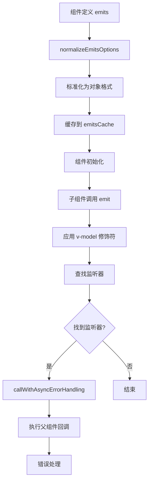

# Emits 系统：从声明到触发

## 1. 概念先行：建立心智模型

### 解决什么问题

在 Vue 3 中，子组件需要向父组件传递消息或事件。Emits 系统就是这个"通信管道"，它规范了子组件可以发出哪些事件，并提供了类型检查和验证机制。

### 核心直觉：客服反馈系统

想象一个客服反馈系统：

- **反馈类型清单**（emits 声明）：公司规定客服只能提交特定类型的反馈（投诉、建议、咨询）
- **反馈标准化**（normalizeEmitsOptions）：无论客服怎么填写反馈表，最终都转成统一的标准格式
- **提交反馈**（emit 函数）：客服填写反馈内容，系统验证类型是否合法，然后发送给上级
- **上级处理**（父组件监听器）：上级收到反馈后，根据类型执行相应的处理流程

**核心流程**：

```
声明 emits → 标准化为统一格式 → 运行时调用 emit → 验证 → 触发父组件监听器
```

**解决的问题**：

- 明确组件可以发出哪些事件（类似 TypeScript 的类型声明）
- 支持事件验证（类似 props 的 validator）
- 区分原生事件和自定义事件
- 避免事件名冲突（如 v-model 的 update:modelValue）

## 2. 最小实现：手写"低配版"

以下是 emits 系统的核心逻辑（50 行）：

```js
// 标准化 emits 定义
function normalizeEmitsOptions(comp) {
  const raw = comp.emits;
  const normalized = {};

  if (Array.isArray(raw)) {
    // ['change', 'update'] → { change: null, update: null }
    raw.forEach(key => normalized[key] = null);
  } else if (raw) {
    // { change: null, update: (val) => val > 0 }
    Object.assign(normalized, raw);
  }

  // 缓存结果
  comp.__emitsOptions = normalized;
  return normalized;
}

// emit 函数
function emit(instance, event, ...args) {
  const props = instance.vnode.props || {};

  // 1. 转换事件名：change → onChange
  let handlerName = `on${event[0].toUpperCase() + event.slice(1)}`;
  let handler = props[handlerName];

  // 2. 如果没找到，尝试 kebab-case：user-change → onUserChange
  if (!handler) {
    handlerName = `on${event.replace(/-(\w)/g, (_, c) => c.toUpperCase())}`;
    handler = props[handlerName];
  }

  // 3. 验证事件（如果有 validator）
  const emitsOptions = instance.emitsOptions;
  if (emitsOptions) {
    const validator = emitsOptions[event];
    if (validator && typeof validator === 'function') {
      const isValid = validator(...args);
      if (!isValid) {
        console.warn(`Invalid event arguments: event "${event}" failed validation`);
      }
    }
  }

  // 4. 调用监听器
  if (handler) {
    handler(...args);
  }
}
```

**运行示例**：

```js
// 组件定义
const MyComponent = {
  emits: {
    change: null,
    update: (value) => value > 0  // 验证器
  },
  setup(props, { emit }) {
    emit('change', 'new value');  // 触发 onChange
    emit('update', 10);            // 验证通过
    emit('update', -5);            // 验证失败，警告
  }
};

// 父组件使用
<MyComponent
  @change="handleChange"
  @update="handleUpdate"
/>
```

## 3. 逐行解剖：关键路径分析

### 3.1 normalizeEmitsOptions：标准化 emits 定义

Vue 3 源码中的 `normalizeEmitsOptions` 处理两种输入格式：

| 输入格式 | 示例 | 标准化后 |
|---------|------|---------|
| 数组 | `['change', 'update']` | `{ change: null, update: null }` |
| 对象-无验证 | `{ change: null }` | 保持不变 |
| 对象-有验证 | `{ update: (val) => val > 0 }` | 保持不变 |

**核心逻辑**：

```js
function normalizeEmitsOptions(comp, appContext, asMixin = false) {
  const cache = appContext.emitsCache;
  const cached = cache.get(comp);
  if (cached !== undefined) {
    return cached;
  }

  const raw = comp.emits;
  let normalized = {};

  // 继承父类的 emits
  let hasExtends = false;
  if (!isFunction(comp)) {
    const extendEmits = (raw) => {
      const normalizedFromExtend = normalizeEmitsOptions(raw, appContext, true);
      if (normalizedFromExtend) {
        hasExtends = true;
        extend(normalized, normalizedFromExtend);
      }
    };

    if (!asMixin && appContext.mixins.length) {
      appContext.mixins.forEach(extendEmits);
    }
    if (comp.extends) {
      extendEmits(comp.extends);
    }
    if (comp.mixins) {
      comp.mixins.forEach(extendEmits);
    }
  }

  // 处理当前组件的 emits
  if (!raw && !hasExtends) {
    cache.set(comp, null);
    return null;
  }

  if (isArray(raw)) {
    raw.forEach(key => (normalized[key] = null));
  } else {
    extend(normalized, raw);
  }

  cache.set(comp, normalized);
  return normalized;
}
```

| 代码片段 | 逻辑拆解 |
|---------|---------|
| `cache.get(comp)` | **缓存优化**：同一个组件定义只标准化一次，避免重复计算 |
| `extendEmits(comp.extends)` | **继承支持**：合并 extends 和 mixins 的 emits 定义 |
| `isArray(raw)` | **数组转对象**：`['change']` → `{ change: null }` |
| `extend(normalized, raw)` | **对象合并**：保留验证器函数 |

### 3.2 emit：触发事件

运行时调用 `emit` 函数触发事件：

```js
function emit(
  instance: ComponentInternalInstance,
  event: string,
  ...rawArgs: any[]
) {
  const props = instance.vnode.props || EMPTY_OBJ;

  // 1. 处理 v-model 修饰符
  let args = rawArgs;
  const isModelListener = event.startsWith('update:');
  const modelArg = isModelListener && event.slice(7);

  if (modelArg && modelArg in props) {
    const modifiersKey = `${modelArg === 'modelValue' ? 'model' : modelArg}Modifiers`;
    const { number, trim } = props[modifiersKey] || EMPTY_OBJ;

    if (trim) {
      args = rawArgs.map(a => (isString(a) ? a.trim() : a));
    }
    if (number) {
      args = rawArgs.map(toNumber);
    }
  }

  // 2. 开发环境：触发 devtools 事件
  if (__DEV__ || __FEATURE_PROD_DEVTOOLS__) {
    devtoolsComponentEmit(instance, event, args);
  }

  // 3. 查找事件监听器
  let handlerName;
  let handler = props[(handlerName = toHandlerKey(event))];

  // 尝试 camelCase 版本
  if (!handler && event.startsWith('update:')) {
    handlerName = toHandlerKey(camelize(event));
    handler = props[handlerName];
  }

  // 4. 调用监听器
  if (handler) {
    callWithAsyncErrorHandling(
      handler,
      instance,
      ErrorCodes.COMPONENT_EVENT_HANDLER,
      args
    );
  }

  // 5. 调用 onXxx 形式的监听器（once 版本）
  const onceHandler = props[handlerName + `Once`];
  if (onceHandler) {
    if (!instance.emitted) {
      instance.emitted = {};
    } else if (instance.emitted[handlerName]) {
      return;
    }
    instance.emitted[handlerName] = true;
    callWithAsyncErrorHandling(
      onceHandler,
      instance,
      ErrorCodes.COMPONENT_EVENT_HANDLER,
      args
    );
  }
}
```

| 代码片段 | 逻辑拆解 |
|---------|---------|
| `event.startsWith('update:')` | **v-model 特殊处理**：识别 v-model 事件，应用修饰符（trim、number） |
| `toHandlerKey(event)` | **命名转换**：`change` → `onChange`，`user-change` → `onUserChange` |
| `callWithAsyncErrorHandling` | **错误处理**：捕获监听器中的异常，避免影响其他逻辑 |
| `props[handlerName + 'Once']` | **once 修饰符**：支持 `@change.once`，只触发一次 |

### 3.3 isEmitListener：判断是否是 emit 监听器

区分原生事件和自定义事件：

```js
function isEmitListener(
  options: ObjectEmitsOptions | null,
  key: string
): boolean {
  if (!options || !isOn(key)) {
    return false;
  }

  // 移除 on 前缀：onChange → change
  key = key.slice(2).replace(/Once$/, '');

  return (
    hasOwn(options, key[0].toLowerCase() + key.slice(1)) ||
    hasOwn(options, hyphenate(key)) ||
    hasOwn(options, key)
  );
}
```

| 代码片段 | 逻辑拆解 |
|---------|---------|
| `isOn(key)` | **前缀检查**：只处理 `on` 开头的属性 |
| `key.slice(2)` | **移除前缀**：`onChange` → `change` |
| `hasOwn(options, key)` | **多种命名检查**：支持 camelCase、kebab-case、原始名称 |

## 4. 细节补充：边界与性能优化

### 4.1 v-model 修饰符处理

v-model 的 `.trim` 和 `.number` 修饰符在 emit 时自动应用：

```js
// 组件定义
<script setup>
defineEmits(['update:modelValue']);
</script>

// 父组件使用
<MyInput v-model.trim.number="value" />

// 等价于
<MyInput
  :modelValue="value"
  @update:modelValue="value = $event"
  :modelModifiers="{ trim: true, number: true }"
/>
```

**emit 内部处理**：

```js
// 子组件 emit 时
emit('update:modelValue', '  123  ');

// 自动应用修饰符
// 1. trim: '  123  ' → '123'
// 2. number: '123' → 123
// 最终父组件收到：123（数字）
```

### 4.2 事件验证

类似 props 的 validator，emits 也支持验证：

```js
export default {
  emits: {
    // 无验证
    click: null,

    // 有验证
    submit: (payload) => {
      if (!payload.email) {
        console.warn('submit event requires email');
        return false;
      }
      return true;
    }
  }
};
```

**验证时机**：

- 仅在开发环境执行
- 验证失败只会警告，不会阻止事件触发
- 生产环境会被移除（通过 tree-shaking）

### 4.3 原生事件 vs 自定义事件

Vue 3 如何区分原生事件和自定义事件？

```js
// 原生事件：不在 emits 中声明
<button @click="handleClick">Click</button>

// 自定义事件：在 emits 中声明
emits: ['custom-click']
<MyComponent @custom-click="handleCustomClick" />
```

**区分逻辑**：

| 场景 | emits 声明 | 监听器位置 | 行为 |
|------|-----------|-----------|------|
| 原生事件 | 未声明 `click` | 添加到根元素 | 作为原生 DOM 事件 |
| 自定义事件 | 声明 `click` | 不添加到根元素 | 作为组件事件，通过 emit 触发 |

**源码判断**：

```js
// 在 patchProps 中
if (isEmitListener(instance.emitsOptions, key)) {
  // 是自定义事件，不添加到 DOM
  return;
}
// 是原生事件，添加到 DOM
patchEvent(el, key, prevValue, nextValue);
```

### 4.4 once 修饰符的实现

`@change.once` 只触发一次：

```js
// 父组件
<MyComponent @change.once="handleChange" />

// 编译后
<MyComponent onChangeOnce={handleChange} />

// emit 内部
const onceHandler = props[handlerName + 'Once'];
if (onceHandler) {
  if (!instance.emitted) {
    instance.emitted = {};
  } else if (instance.emitted[handlerName]) {
    return; // 已触发过，直接返回
  }
  instance.emitted[handlerName] = true;
  callWithAsyncErrorHandling(onceHandler, instance, ErrorCodes.COMPONENT_EVENT_HANDLER, args);
}
```

**实现原理**：

- 使用 `instance.emitted` 对象记录已触发的事件
- 第二次触发时检查记录，直接返回

### 4.5 性能优化：缓存机制

```js
const cache = appContext.emitsCache;
const cached = cache.get(comp);
if (cached !== undefined) {
  return cached;
}
```

**缓存策略**：

- 每个应用实例（appContext）有独立的 emitsCache
- 同一个组件定义只标准化一次
- 使用 WeakMap 存储，组件销毁时自动清理

### 4.6 错误处理

emit 触发的监听器中的错误会被捕获：

```js
callWithAsyncErrorHandling(
  handler,
  instance,
  ErrorCodes.COMPONENT_EVENT_HANDLER,
  args
);
```

**错误处理流程**：

```js
function callWithAsyncErrorHandling(fn, instance, type, args) {
  try {
    return args ? fn(...args) : fn();
  } catch (err) {
    handleError(err, instance, type);
  }
}
```

- 捕获同步错误
- 调用全局错误处理器（app.config.errorHandler）
- 不会影响其他监听器的执行

## 5. 总结与延伸

### 一句话总结

Emits 系统通过标准化（normalizeEmitsOptions）将多种定义格式统一，再通过 emit 函数查找并触发父组件的监听器，并支持事件验证、v-model 修饰符、once 修饰符等特性。

### 完整流程回顾



### 面试考点

**Q1：Vue 3 的 emits 有什么作用？**

1. 明确组件可以发出哪些事件（文档化）
2. 支持事件验证（类似 props validator）
3. 区分原生事件和自定义事件
4. 提供更好的 TypeScript 类型推断

**Q2：emits 和 props 有什么区别？**

| 特性 | Props | Emits |
|------|-------|-------|
| 数据流向 | 父 → 子 | 子 → 父 |
| 类型检查 | 支持（type、validator） | 支持（validator） |
| 默认值 | 支持（default） | 不支持 |
| 响应式 | 是（shallowReactive） | 否（只是函数调用） |

**Q3：为什么要在 emits 中声明事件？**

1. **避免原生事件冲突**：未声明的 `click` 会作为原生事件添加到根元素
2. **类型安全**：TypeScript 可以推断 emit 的事件名和参数类型
3. **文档化**：明确组件的对外接口
4. **性能优化**：避免不必要的原生事件监听器

**Q4：v-model 的 .trim 和 .number 修饰符是如何工作的？**

- 编译时：将修饰符转换为 `modelModifiers` prop
- 运行时：emit 函数检测到 `update:xxx` 事件时，自动应用修饰符
- 顺序：先 trim，后 number

**Q5：emit 触发的监听器中抛出错误会怎样？**

- 错误会被 `callWithAsyncErrorHandling` 捕获
- 调用全局错误处理器（如果配置了）
- 不会影响其他监听器的执行
- 不会导致应用崩溃

### 延伸阅读

- **上一章节**：[Props 系统](./1-3.1-props.md) - 了解 props 和 emits 的对比
- **相关主题**：
  - v-model 的实现原理（update:modelValue + modelModifiers）
  - 事件修饰符的编译过程（.once、.capture、.passive）
  - 组件通信的其他方式（provide/inject、Vuex、Pinia）
  - TypeScript 中的 emits 类型推断
