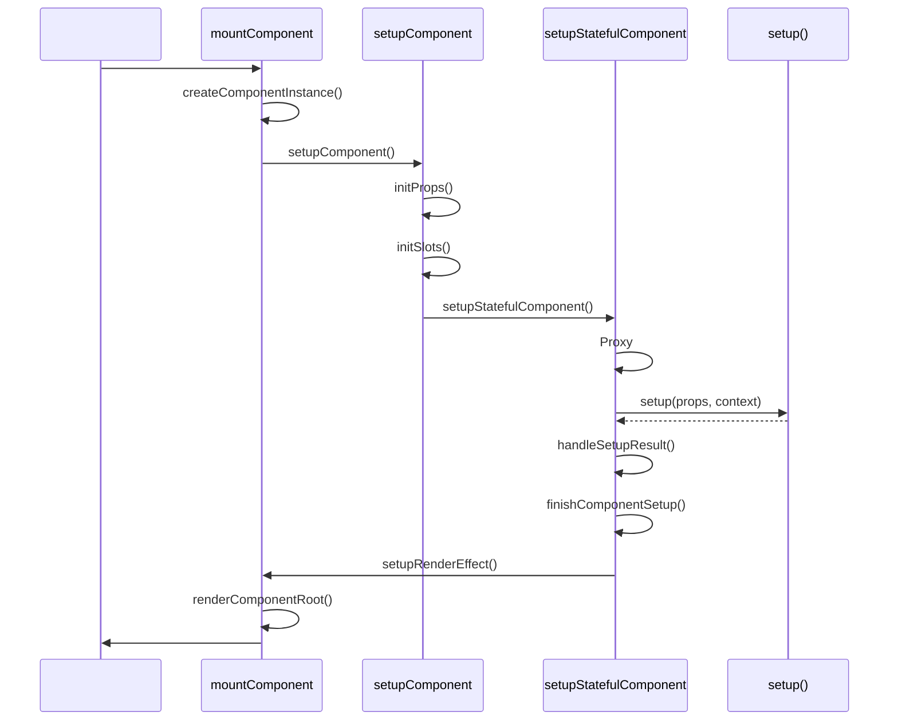

# setup()
##
`setup()`  Vue 3 Composition API setup()
---
##  setup()
```mermaid
graph TD
    A["setupStatefulComponent()"] -->|| B{Component.setup?}
    B -->|| C[" setup"]
    B -->|| D["pauseTracking()"]
    D -->|| E[""]
    E -->|| F{setup.length > 1?}
    F -->|>1| G["createSetupContext()"]
    F -->|<=1| H["context = null"]
    G -->|| I["setupContext"]
    H -->|| J["setCurrentInstance()"]
    I -->|| J
    J -->|| K["currentInstance"]
    K -->|| L["setup(props, context)"]
    L -->|| M{?}
    M -->|Promise| N[" setup"]
    M -->|Function| O["render "]
    M -->|Object| P["setupState "]
    N -->|| Q["handleSetupResult()"]
    O -->|| Q
    P -->|| Q
    Q -->|| R["finishComponentSetup()"]
```
---
##  setup()
###

---
##  setup()
###  1: Props
```typescript
// setup  props
setup(props: Record<string, any>) {
  // props
  //
  //
}
```
**Props **
```mermaid
graph TD
    A["VNode.props"] -->|extract| B[""]
    B -->|normalize| C[""]
    C -->|defaults| D[""]
    D -->|readonly| E[""]
    E -->|setup| F[" setup"]
    Note1[" "]
    Note2[" "]
    Note3[" "]
    F --> Note1
    F --> Note2
    F --> Note3
```
###  2: SetupContext
```typescript
//  setup.length > 1  context
setup(props, context) {
  context.attrs      //  props
  context.slots      //
  context.emit       //
  context.expose     //
  context.slots      //
}
```
**SetupContext **
```typescript
const setupContext = setup.length > 1 ? createSetupContext(instance) : null
//
// -
// -  setup  props context
```
---
##  setup()
###  1
```typescript
pauseTracking()
//
// setup
//
//  render
//
const count = ref(0)
setup() {
  count.value  //
}
render() {
  count.value  //
}
```
###  2
```typescript
//  context
setup.length > 1 ? createSetupContext(instance) : null
//  1 props
function setup(props) {
  // length = 1
  // context
}
//  2 props  context
function setup(props, context) {
  // length = 2
  // context
}
//  3
function setup() {
  // length = 0
  // context
}
```
###  3
```typescript
const reset = setCurrentInstance(instance)
//
// 1.  setup  getCurrentInstance()
// 2.  setup  inject()
// 3.  useXxx() composables
//
setup() {
  const instance = getCurrentInstance()
  const injectedValue = inject('key')
  // ...
  return reset  //
}
```
###  4  setup()
```typescript
const setupResult = callWithErrorHandling(
  setup,
  instance,
  ErrorCodes.SETUP_FUNCTION,
  [
    __DEV__ ? shallowReadonly(instance.props) : instance.props,
    setupContext,
  ],
)
```
****
```typescript
// Props
setup(props: Readonly<Props>) {
  props.count = 1  //
}
// Props
setup(props) {
  props.count = 1  //
}
```
###  5
```typescript
resetTracking()
reset()
// resetTracking:
// reset:
```
---
##  setup()
###  1:
```typescript
setup() {
  const count = ref(0)
  const message = 'Hello'
  const increment = () => {
    count.value++
  }
  return {
    count,        //
    message,      //
    increment,    //
  }
}
//
// 1. proxyRefs(setupResult) -  ref
// 2.  {{ count }}
// 3.  this
```
**proxyRefs **
```mermaid
graph TD
    A["setupResult"] -->|| B["ref "]
    A -->|| C[""]
    D["proxyRefs(setupResult)"]
    B -->|| E[" .value"]
    C -->|| F[""]
    D --> B
    D --> C
    G[""]
    E -->| .value| H["{{ count }}"]
    F -->|| I["{{ message }}"]
    G --> H
    G --> I
```
###  2:  render
```typescript
setup() {
  return () => h('div', 'Hello')
}
//
// 1.
// 2.  instance.render
// 3.  renderComponentRoot
```
###  3:  setup
```typescript
setup() {
  return new Promise(resolve => {
    setTimeout(() => {
      resolve({ count: ref(0) })
    }, 1000)
  })
}
//
// 1.  Promise
// 2.  instance.asyncDep
// 3.  Suspense
// 4. Promise
```
---
##
###  1:
```typescript
import { ref, computed } from 'vue'
export default {
  props: {
    title: String,
  },
  setup(props) {
    const count = ref(0)
    const doubled = computed(() => count.value * 2)
    return {
      count,
      doubled,
      increment: () => count.value++,
    }
  },
}
```
****
```
1. createComponentInstance()
2. initProps({ title: 'Hello' })
3. setup(props, undefined)  // length = 1 context
4. return { count, doubled, increment }
5. proxyRefs()
6. instance.setupState = { count: 0, doubled: 0, increment: fn }
```
###  2:  context
```typescript
export default {
  emits: ['update'],
  slots: {
    default: () => {},
  },
  setup(props, { emit, slots }) {
    // length = 2 context
    const handleClick = () => {
      emit('update', 'new value')
    }
    return {
      handleClick,
      slots,
    }
  },
}
```
###  3:
```typescript
import { getCurrentInstance } from 'vue'
export default {
  setup() {
    const instance = getCurrentInstance()
    console.log(instance.vnode.type.name)  //
    console.log(instance.parent)            //
    console.log(instance.root)              //
    return {}
  },
}
```
###  4:  setup
```typescript
export default {
  async setup() {
    //  Suspense
    const data = await fetch('/api/data').then(r => r.json())
    return {
      data,
    }
  },
}
```
```vue
<Suspense>
  <MyComponent />
  <template #fallback>
    <div>Loading...</div>
  </template>
</Suspense>
```
---
##
### 1.
```typescript
//  context
setup(props) {
  // context
}
// vs
setup(props, context) {
  // context
}
```
### 2.
```typescript
setup() {
  //   render
  const list = items.value.map(item => item * 2)
  return { list }
}
setup() {
  //   computed
  const list = computed(() => items.value.map(item => item * 2))
  return { list }
}
```
### 3.
```typescript
// setup
//  setup
```
---
##
```mermaid
graph LR
    A["setup() "] -->|| B["props"]
    A -->| context| C["attrs, slots, emit"]
    B -->| data| D["getCurrentInstance()"]
    C -->|| E["inject()"]
    D -->|| F["currentInstance"]
    E -->| provide | F
    F -->|setup | G[""]
    G -->|| H[""]
    G -->|| I[""]
    G -->|| J["Promise"]
    H -->|proxyRefs| K["setupState"]
    I -->|| L["render "]
    J -->|| M["asyncDep"]
    K -->|| N["finishComponentSetup"]
    L -->|| N
    M -->|| N
```
---
##
- [](./1-3-component-init.md) -  setup()
- [](./1-5-render-effect.md) -
- [mount  render](./1-2-mount.md) -
- [](./1-1-overview.md) -
---
##  FAQ
**Q:  setup /**
A: setup  render
**Q:  context**
A:  emitslotsattrs  expose
**Q: setup **
A:  Suspense
**Q:  setup  this**
A: setup  this getCurrentInstance()  inject()
