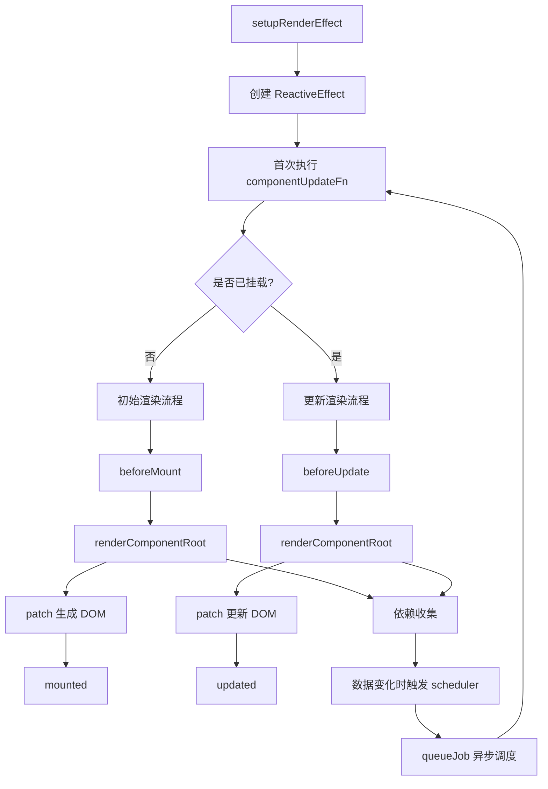
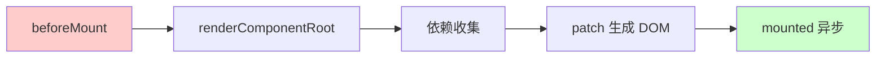
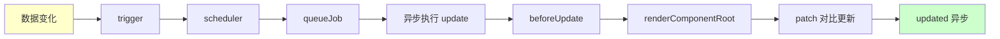
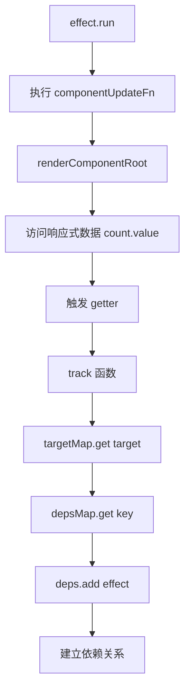
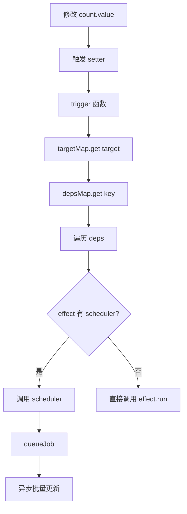
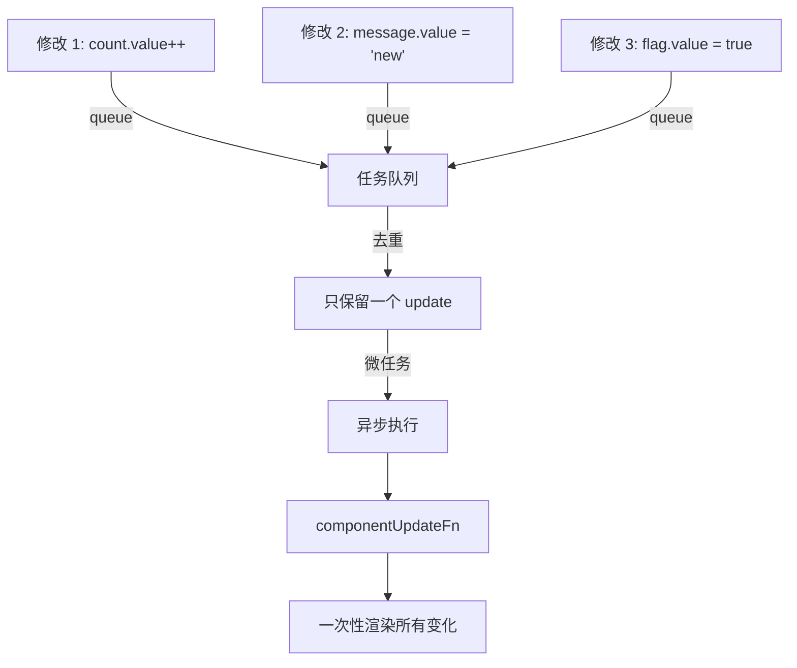
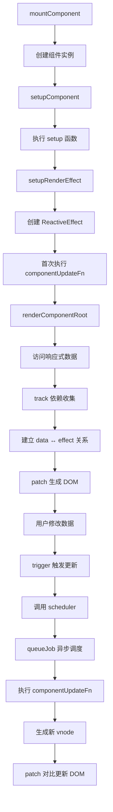

# setupRenderEffect：组件渲染的响应式引擎

## 1. 概念先行：建立心智模型

### 解决什么问题

在 Vue 3 中，当组件的响应式数据发生变化时，视图需要自动更新。`setupRenderEffect` 就是连接响应式系统和渲染系统的桥梁，它创建了一个"自动监听数据变化并重新渲染"的机制。

### 核心直觉：订阅报纸的故事

想象你订阅了一份报纸：

- **报社（响应式数据）**：存储着最新的新闻内容
- **订阅关系（ReactiveEffect）**：你和报社建立了订阅关系
- **送报员（scheduler）**：不会每次新闻更新都立即送报，而是每天早上统一配送
- **你读报纸（componentUpdateFn）**：收到报纸后，你会阅读并了解最新内容

`setupRenderEffect` 就是帮组件"订阅"数据变化的过程：
- 首次订阅时，立即读一次报纸（初始渲染）
- 之后每当报社有新内容，送报员会在合适的时机送来（异步更新）
- 你每次读报纸时，报社都会记录你关心哪些版面（依赖收集）

### 流程总览



---

## 2. 最小实现：手写"低配版"

下面是一个 40 行的最小实现，展示 `setupRenderEffect` 的核心逻辑：

```javascript
// 简化版的 setupRenderEffect
function setupRenderEffect(instance, container) {
  // 1. 定义组件更新函数
  const componentUpdateFn = () => {
    if (!instance.isMounted) {
      // 初始渲染
      console.log('beforeMount')

      // 执行 render 函数生成 vnode（这里会触发依赖收集）
      const subTree = instance.render()
      instance.subTree = subTree

      // 将 vnode 转换为真实 DOM
      patch(null, subTree, container)

      console.log('mounted')
      instance.isMounted = true
    } else {
      // 更新渲染
      console.log('beforeUpdate')

      const prevTree = instance.subTree
      const nextTree = instance.render()
      instance.subTree = nextTree

      // 对比新旧 vnode，更新 DOM
      patch(prevTree, nextTree, container)

      console.log('updated')
    }
  }

  // 2. 创建响应式副作用
  const effect = new ReactiveEffect(
    componentUpdateFn,
    () => queueJob(instance.update) // scheduler：异步调度
  )

  // 3. 将 effect.run 绑定为 instance.update
  instance.update = effect.run.bind(effect)

  // 4. 首次执行，触发初始渲染
  instance.update()
}
```

**运行示例**：

```javascript
// 模拟一个组件实例
const instance = {
  isMounted: false,
  render: () => {
    // 访问响应式数据会触发依赖收集
    return h('div', count.value)
  }
}

// 响应式数据
const count = ref(0)

// 设置渲染副作用
setupRenderEffect(instance, document.body)

// 修改数据会触发异步更新
count.value++ // 触发 scheduler -> queueJob -> 异步执行 update
```

---

## 3. 逐行解剖：关键路径分析

### 3.1 setupRenderEffect 函数签名

```typescript
const setupRenderEffect: SetupRenderEffectFn = (
  instance,        // 组件实例
  initialVNode,    // 组件的 vnode
  container,       // 挂载容器
  anchor,          // 挂载锚点
  parentSuspense,  // 父级 Suspense
  namespace,       // 命名空间（SVG/MathML）
  optimized,       // 是否优化模式
) => {
  // ...
}
```

### 3.2 核心步骤拆解

| 步骤 | 源码片段 | 逻辑拆解 |
|------|----------|----------|
| **1. 定义更新函数** | `const componentUpdateFn = () => { ... }` | 包含初始渲染和更新渲染两个分支，是组件渲染的核心逻辑 |
| **2. 创建响应式副作用** | `new ReactiveEffect(componentUpdateFn, scheduler, scope)` | 将更新函数包装为响应式副作用，使其能够自动追踪依赖 |
| **3. 绑定 update 方法** | `instance.update = effect.run.bind(effect)` | 将副作用的执行方法暴露为 `instance.update`，供外部调用 |
| **4. 首次执行** | `effect.run()` | 立即执行一次，触发初始渲染并收集依赖 |

### 3.3 componentUpdateFn：初始渲染分支

```typescript
if (!instance.isMounted) {
  let vnodeHook: VNodeHook | null | undefined
  const { el, props } = initialVNode
  const { bm, m, parent, root, type } = instance

  // 1. 禁用递归更新标记
  toggleRecurse(instance, false)

  // 2. 调用 beforeMount 生命周期
  if (bm) {
    invokeArrayFns(bm)
  }

  // 3. 调用 vnode 的 onVnodeBeforeMount 钩子
  if (
    !isAsyncWrapperVNode &&
    (vnodeHook = props && props.onVnodeBeforeMount)
  ) {
    invokeVNodeHook(vnodeHook, parent, initialVNode)
  }

  // 4. 恢复递归更新标记
  toggleRecurse(instance, true)

  // 5. SSR 水合逻辑（省略）
  if (el && hydrateNode) {
    // ...
  } else {
    // 6. 执行 render 函数生成 subTree（依赖收集发生在这里）
    const subTree = (instance.subTree = renderComponentRoot(instance))

    // 7. 将 subTree 转换为真实 DOM
    patch(
      null,
      subTree,
      container,
      anchor,
      instance,
      parentSuspense,
      namespace,
    )

    // 8. 将真实 DOM 元素引用保存到 vnode
    initialVNode.el = subTree.el
  }

  // 9. 调用 mounted 生命周期（异步）
  if (m) {
    queuePostRenderEffect(m, parentSuspense)
  }

  // 10. 调用 vnode 的 onVnodeMounted 钩子
  if (vnodeHook = props && props.onVnodeMounted) {
    queuePostRenderEffect(
      () => invokeVNodeHook(vnodeHook!, parent, initialVNode),
      parentSuspense,
    )
  }

  // 11. KeepAlive 的 activated 钩子
  if (
    initialVNode.shapeFlag & ShapeFlags.COMPONENT_SHOULD_KEEP_ALIVE ||
    (parent && isAsyncWrapper(parent.vnode) &&
     parent.vnode.shapeFlag & ShapeFlags.COMPONENT_SHOULD_KEEP_ALIVE)
  ) {
    instance.a && queuePostRenderEffect(instance.a, parentSuspense)
  }

  // 12. 标记为已挂载
  instance.isMounted = true

  // 13. Devtools 通知
  if (__DEV__ || __FEATURE_PROD_DEVTOOLS__) {
    devtoolsComponentAdded(instance)
  }

  // 14. 释放引用，帮助 GC
  initialVNode = container = anchor = null as any
}
```

**初始渲染流程图**：



**关键点解析**：

| 源码片段 | 设计意图 |
|----------|----------|
| `toggleRecurse(instance, false/true)` | 防止在生命周期钩子中触发的更新导致无限递归 |
| `renderComponentRoot(instance)` | 执行组件的 render 函数，访问响应式数据时会触发 track 进行依赖收集 |
| `patch(null, subTree, ...)` | 首次渲染传入 `null` 作为旧节点，表示全新创建 DOM |
| `queuePostRenderEffect(m, ...)` | mounted 钩子异步执行，确保 DOM 已完全渲染 |
| `instance.isMounted = true` | 标记已挂载，后续更新会走 else 分支 |
| `initialVNode = ... = null` | 释放不再需要的引用，避免内存泄漏 |

### 3.4 componentUpdateFn：更新渲染分支

```typescript
else {
  // 更新渲染
  let { next, bu, u, parent, vnode } = instance

  // Suspense 异步组件处理（省略）
  if (__FEATURE_SUSPENSE__) {
    const nonHydratedAsyncRoot = locateNonHydratedAsyncRoot(instance)
    if (nonHydratedAsyncRoot) {
      // ...
      return
    }
  }

  // 1. 保存原始的 next
  let originNext = next

  // 2. 处理组件更新前的准备工作
  toggleRecurse(instance, false)
  if (next) {
    // next 存在说明是父组件触发的更新（props 变化）
    next.el = vnode.el
    updateComponentPreRender(instance, next, optimized)
  } else {
    // next 不存在说明是自身数据变化触发的更新
    next = vnode
  }
  toggleRecurse(instance, true)

  // 3. 保存旧的 subTree
  const prevTree = instance.subTree
  const nextTree = (instance.subTree = renderComponentRoot(instance))

  // 4. 调用 beforeUpdate 生命周期
  if (bu) {
    invokeArrayFns(bu)
  }

  // 5. 对比新旧 vnode，更新 DOM
  patch(
    prevTree,
    nextTree,
    hostParentNode(prevTree.el!)!,
    getNextHostNode(prevTree),
    instance,
    parentSuspense,
    namespace,
  )

  // 6. 更新 el 引用
  next.el = nextTree.el
  if (originNext === null) {
    updateHOCHostEl(instance, nextTree.el)
  }

  // 7. 调用 updated 生命周期（异步）
  if (u) {
    queuePostRenderEffect(u, parentSuspense)
  }

  // 8. 调用 vnode 的 onVnodeUpdated 钩子
  if (vnodeHook = next.props && next.props.onVnodeUpdated) {
    queuePostRenderEffect(
      () => invokeVNodeHook(vnodeHook!, parent, next!, vnode),
      parentSuspense,
    )
  }
}
```

**更新渲染流程图**：



**关键点解析**：

| 源码片段 | 设计意图 |
|----------|----------|
| `next` 的判断 | `next` 存在表示父组件触发的更新（props 变化），需要调用 `updateComponentPreRender` 更新 props/slots |
| `renderComponentRoot(instance)` | 再次执行 render 函数，生成新的 vnode 树，同时重新收集依赖 |
| `patch(prevTree, nextTree, ...)` | 传入新旧两棵树，进行 diff 算法对比，最小化 DOM 操作 |
| `queuePostRenderEffect(u, ...)` | updated 钩子异步执行，确保 DOM 已更新完成 |

### 3.5 ReactiveEffect：响应式副作用

```typescript
const effect = (instance.effect = new ReactiveEffect(
  componentUpdateFn,              // 副作用函数
  () => queueJob(instance.update), // scheduler：调度器
  instance.scope,                  // scope：作用域
))
```

**ReactiveEffect 的作用**：

| 参数 | 作用 |
|------|------|
| `componentUpdateFn` | 副作用函数，会在首次执行和依赖变化时被调用 |
| `scheduler` | 调度器函数，当依赖变化时不会立即执行副作用，而是调用 scheduler |
| `instance.scope` | EffectScope 实例，用于管理副作用的生命周期 |

**依赖收集流程**：



**依赖触发流程**：



### 3.6 Scheduler：异步调度器

```typescript
() => queueJob(instance.update)
```

**为什么需要 scheduler？**

1. **批量更新**：多次数据修改只触发一次渲染
2. **异步更新**：不阻塞当前执行栈
3. **去重优化**：同一个组件的多次更新会被合并

**queueJob 简化实现**：

```typescript
const queue: SchedulerJob[] = []
let isFlushing = false

function queueJob(job: SchedulerJob) {
  // 去重：同一个 job 只会被添加一次
  if (!queue.includes(job)) {
    queue.push(job)
  }
  // 在下一个微任务中执行队列
  queueFlush()
}

function queueFlush() {
  if (!isFlushing) {
    isFlushing = true
    Promise.resolve().then(flushJobs)
  }
}

function flushJobs() {
  for (const job of queue) {
    job() // 执行 instance.update
  }
  queue.length = 0
  isFlushing = false
}
```

**批量更新示意图**：



### 3.7 EffectScope：作用域管理

```typescript
instance.scope = new EffectScope(true /* detached */)
```

**EffectScope 的作用**：

- 统一管理组件内的所有副作用（effect、computed、watch）
- 组件卸载时，调用 `instance.scope.stop()` 一次性清理所有副作用
- `detached: true` 表示独立作用域，不受父级 scope 影响

**卸载时的清理**：

```typescript
// 组件卸载时
instance.scope.stop()

// 内部会执行：
// 1. 停止所有 effects（取消依赖关系）
// 2. 停止所有 watchers
// 3. 清理所有 computed
// 4. 释放内存引用
```

---

## 4. 细节补充：边界与性能优化

### 4.1 为什么 mounted/updated 要异步执行？

```typescript
// mounted 和 updated 使用 queuePostRenderEffect 异步执行
if (m) {
  queuePostRenderEffect(m, parentSuspense)
}
```

**原因**：

1. **确保 DOM 已渲染**：生命周期钩子执行时，DOM 已经完全更新
2. **避免阻塞渲染**：生命周期钩子中的耗时操作不会阻塞 DOM 更新
3. **符合直觉**：用户在 mounted 中访问 DOM 元素时，元素已经存在

### 4.2 toggleRecurse 的作用

```typescript
toggleRecurse(instance, false) // 禁用递归
// ... 执行生命周期钩子
toggleRecurse(instance, true)  // 恢复递归
```

**防止无限递归**：

```javascript
// 如果没有 toggleRecurse，以下代码会导致无限循环
onBeforeUpdate(() => {
  count.value++ // 触发新的更新 -> 再次调用 beforeUpdate -> 无限循环
})
```

`toggleRecurse` 会临时标记组件"正在更新中"，阻止嵌套的更新触发。

### 4.3 为什么要释放引用？

```typescript
// 初始渲染完成后
initialVNode = container = anchor = null as any
```

**内存优化**：

- `initialVNode`、`container`、`anchor` 在初始渲染后不再需要
- 将它们设为 `null` 可以让 GC 回收这些对象
- 特别是 `initialVNode` 可能引用大量子节点，及时释放很重要

### 4.4 next 的两种情况

| 情况 | next 的值 | 触发原因 | 处理方式 |
|------|-----------|----------|----------|
| **自身数据变化** | `undefined` | 组件内部响应式数据修改 | `next = vnode`，直接使用当前 vnode |
| **父组件触发更新** | 新的 vnode | 父组件传递的 props 变化 | 调用 `updateComponentPreRender` 更新 props/slots |

### 4.5 性能优化：批量更新的威力

**场景 1：循环修改数据**

```javascript
// 没有批量更新：触发 1000 次渲染
for (let i = 0; i < 1000; i++) {
  count.value++
}

// 有批量更新：只触发 1 次渲染
for (let i = 0; i < 1000; i++) {
  count.value++ // 所有修改被合并到一个 update
}
```

**场景 2：多个数据同时修改**

```javascript
// 没有批量更新：触发 3 次渲染
count.value++
message.value = 'new'
flag.value = true

// 有批量更新：只触发 1 次渲染
count.value++
message.value = 'new'
flag.value = true
// 三次修改被合并到一个 update
```

### 4.6 SSR 水合（Hydration）

```typescript
if (el && hydrateNode) {
  // SSR 水合逻辑
  const hydrateSubTree = () => {
    instance.subTree = renderComponentRoot(instance)
    hydrateNode!(el as Node, instance.subTree, instance, parentSuspense, null)
  }
  // ...
}
```

**水合的作用**：

- 服务端渲染时，HTML 已经存在
- 客户端不需要重新创建 DOM，只需要"激活"现有 DOM
- `hydrateNode` 会将 vnode 和现有 DOM 关联起来，并绑定事件监听器

---

## 5. 总结与延伸

### 一句话总结

`setupRenderEffect` 通过创建 ReactiveEffect 将组件的渲染函数包装为响应式副作用，实现了"数据变化 → 自动重新渲染"的核心机制，并通过 scheduler 实现了异步批量更新优化。

### 完整流程回顾



### 面试考点

**Q1：Vue 3 的组件更新是同步还是异步的？为什么？**

异步的。通过 scheduler 将更新任务放入队列，在下一个微任务中批量执行。这样可以：
1. 合并多次数据修改，只触发一次渲染
2. 避免阻塞当前执行栈
3. 提升性能

**Q2：为什么 mounted 钩子中可以访问 DOM？**

因为 mounted 钩子通过 `queuePostRenderEffect` 异步执行，会在 patch 完成（DOM 已渲染）后才调用。

**Q3：如果在 beforeUpdate 中修改数据，会发生什么？**

会被 `toggleRecurse` 机制阻止，不会触发新的更新，避免无限递归。

**Q4：Vue 3 如何实现批量更新？**

通过 `queueJob` 函数：
1. 将 update 任务添加到队列
2. 使用 `Promise.resolve().then()` 在微任务中执行
3. 队列中的重复任务会被去重
4. 一次性执行所有任务

**Q5：组件卸载时如何清理副作用？**

调用 `instance.scope.stop()`，会自动停止所有 effects、watchers、computed，并释放依赖关系。

### 延伸阅读

- [组件初始化流程](./1-3-component-init.md) - 了解 setupRenderEffect 在组件生命周期中的位置
- [setup 函数执行](./1-4-setup.md) - 了解 setup 如何创建响应式数据
- [响应式系统原理](../reactivity/1-1-reactive.md) - 深入理解 track 和 trigger 机制
- [异步更新队列](./1-6-scheduler.md) - 详解 queueJob 和 nextTick 的实现
- [patch 算法](./1-2-mount.md) - 了解 vnode 如何转换为真实 DOM
