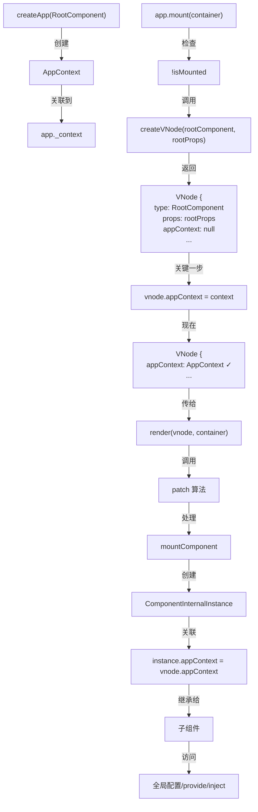

# AppContext 关联到根 VNode 的完整调用链

## 核心一句话总结

在 `app.mount()` 调用中，通过直接赋值 `vnode.appContext = context` 将 AppContext 关联到根 VNode。

## 完整调用链

```
用户代码
  │
  └─→ app.mount(container)
      ├─→ packages/runtime-core/src/apiCreateApp.ts:358
      │
      ├─→ 第一步: 检查是否已挂载
      │  └─ if (!isMounted)
      │
      ├─→ 第二步: 创建根 VNode
      │  ├─ const vnode = app._ceVNode || createVNode(rootComponent, rootProps)
      │  ├─→ packages/runtime-core/src/vnode.ts:543
      │  └─→ 返回根组件的 VNode 对象
      │
      ├─→ 第三步: 关联 AppContext [关键步骤]
      │  ├─ vnode.appContext = context
      │  ├─→ packages/runtime-core/src/apiCreateApp.ts:375
      │  └─ 这里完成了 AppContext 到根 VNode 的关联！
      │
      ├─→ 第四步: HMR 热更新支持（仅 DEV）
      │  └─ 如果是热更新模式，设置 reload 函数
      │
      ├─→ 第五步: 执行渲染或 SSR 水合
      │  ├─ if (isHydrate && hydrate)
      │  │  └─ hydrate(vnode, container)
      │  └─ else
      │     └─ render(vnode, container, namespace)
      │        ├─→ packages/runtime-core/src/renderer.ts (render 函数)
      │        └─→ 开始虚拟 DOM 挂载流程
      │
      ├─→ 第六步: 标记已挂载
      │  └─ isMounted = true
      │
      ├─→ 第七步: 存储容器引用
      │  ├─ app._container = rootContainer
      │  └─ (rootContainer as any).__vue_app__ = app
      │
      └─→ 第八步: 返回根组件的公共实例
         └─ return getComponentPublicInstance(vnode.component!)
```

## 关键代码详解

### 1️⃣ app.mount() 函数位置

```typescript
// packages/runtime-core/src/apiCreateApp.ts:358-419

mount(
  rootContainer: HostElement,
  isHydrate?: boolean,
  namespace?: boolean | ElementNamespace,
): any {
  if (!isMounted) {
    // ... 关键代码在这里
  }
}
```

### 2️⃣ 根 VNode 的创建

```typescript
// packages/runtime-core/src/apiCreateApp.ts:372

const vnode = app._ceVNode || createVNode(rootComponent, rootProps)
```

**说明：**
- `app._ceVNode` - 自定义元素的 VNode（如果有的话）
- 否则调用 `createVNode(rootComponent, rootProps)` 创建根组件的 VNode
- 返回一个新的 VNode 对象，此时 `vnode.appContext` 为 `null`

### 3️⃣ AppContext 关联 [最关键的一行]

```typescript
// packages/runtime-core/src/apiCreateApp.ts:375

vnode.appContext = context
```

**这就是答案！**
- 直接将 app 内部的 `context` 赋值给 `vnode.appContext`
- `context` 来自 `createAppContext()`（在 createApp 时创建）
- 从此刻起，根 VNode 持有 AppContext 的引用

### 4️⃣ 渲染流程开始

```typescript
// packages/runtime-core/src/apiCreateApp.ts:395-399

if (isHydrate && hydrate) {
  hydrate(vnode as VNode<Node, Element>, rootContainer as any)
} else {
  render(vnode, rootContainer, namespace)
}
```

**说明：**
- `hydrate` - SSR 水合模式
- `render` - 普通客户端渲染
- 无论哪种模式，都会将带有 appContext 的 vnode 传给 render 函数

## 时间顺序和数据流

```
时间 T1: createApp(RootComponent)
  ├─ 创建 context (AppContext)
  └─ 创建 app 对象
     └─ app._context = context

时间 T2: app.mount(container)
  ├─ Step 1: createVNode(rootComponent, rootProps)
  │  ├─ 返回 VNode { type, props, children, ... }
  │  └─ vnode.appContext = null (初始值)
  │
  ├─ Step 2: vnode.appContext = context  ← 关键关联
  │  └─ VNode 现在知道自己属于哪个 app
  │
  └─ Step 3: render(vnode, container)
     ├─ patch(null, vnode)  → 挂载
     └─ VNode 和 AppContext 一起传递给 renderer
```

## AppContext 在 VNode 中的用途

关联后，AppContext 被用于：

```
VNode.appContext
  │
  ├─→ patch() 函数 (packages/runtime-core/src/renderer.ts)
  │  └─ 处理组件 VNode 时需要 appContext
  │
  ├─→ createComponentInstance() (packages/runtime-core/src/component.ts)
  │  ├─ const appContext = (parent ? parent.appContext : vnode.appContext)
  │  ├─ 新组件实例继承 appContext
  │  └─ 子组件通过此继承全局配置
  │
  ├─→ 组件初始化
  │  ├─ 访问全局注册的组件 (appContext.components)
  │  ├─ 访问全局指令 (appContext.directives)
  │  ├─ 访问全局混入 (appContext.mixins)
  │  └─ 访问 provide() 提供的值 (appContext.provides)
  │
  └─→ 依赖注入系统 (provide/inject)
     └─ 通过 appContext.provides 查找注入值
```

## 代码流程图



## 详细的代码上下文

### createApp 时创建 AppContext

```typescript
// packages/runtime-core/src/apiCreateApp.ts:257-267

export function createAppAPI<HostElement>(
  render: RootRenderFunction<HostElement>,
  hydrate?: RootHydrateFunction,
): CreateAppFunction<HostElement> {
  return function createApp(rootComponent, rootProps = null) {
    // ...
    const context = createAppContext()  // 在这里创建
    // ...
    const app: App = (context.app = {
      _context: context,  // 保存在 app 对象上
      // ...
    })
  }
}
```

### app.mount() 关联 AppContext

```typescript
// packages/runtime-core/src/apiCreateApp.ts:358-399

mount(
  rootContainer: HostElement,
  isHydrate?: boolean,
  namespace?: boolean | ElementNamespace,
): any {
  if (!isMounted) {
    // 1. 创建或获取根 VNode
    const vnode = app._ceVNode || createVNode(rootComponent, rootProps)

    // 2. 关联 AppContext 到根 VNode
    // 这一行完成了所有的关联！
    vnode.appContext = context  // ← 这就是答案

    // 3. 后续处理 namespace 和 HMR
    if (namespace === true) {
      namespace = 'svg'
    } else if (namespace === false) {
      namespace = undefined
    }

    if (__DEV__) {
      context.reload = () => {
        const cloned = cloneVNode(vnode)
        cloned.el = null
        render(cloned, rootContainer, namespace as ElementNamespace)
      }
    }

    // 4. 执行渲染
    if (isHydrate && hydrate) {
      hydrate(vnode as VNode<Node, Element>, rootContainer as any)
    } else {
      render(vnode, rootContainer, namespace)  // ← 带着 appContext 的 vnode
    }

    // 5. 标记已挂载并保存引用
    isMounted = true
    app._container = rootContainer
    ;(rootContainer as any).__vue_app__ = app

    if (__DEV__ || __FEATURE_PROD_DEVTOOLS__) {
      app._instance = vnode.component
      devtoolsInitApp(app, version)
    }

    return getComponentPublicInstance(vnode.component!)
  }
}
```

### AppContext 如何被使用

```typescript
// packages/runtime-core/src/component.ts:createComponentInstance

export function createComponentInstance(
  vnode: VNode,
  parent: ComponentInternalInstance | null,
  suspense: SuspenseBoundary | null,
): ComponentInternalInstance {
  const type = vnode.type as ConcreteComponent

  // 从 VNode 获取 AppContext
  const appContext =
    (parent ? parent.appContext : vnode.appContext) || emptyAppContext

  const instance: ComponentInternalInstance = {
    // ...
    appContext,  // 保存在组件实例上
    // ...
  }

  return instance
}
```

## 关键信息总结

| 项目 | 说明 |
|------|------|
| **时机** | app.mount() 调用时 |
| **位置** | packages/runtime-core/src/apiCreateApp.ts:375 |
| **代码** | `vnode.appContext = context` |
| **context 来源** | createApp 时创建的 AppContext |
| **vnode 来源** | createVNode(rootComponent, rootProps) |
| **后续传递** | 通过 render 函数传给 patch 算法 |
| **最终使用** | ComponentInternalInstance 继承 appContext |

## 完整的数据流向

```
createApp(RootComponent)
  ↓ 创建 AppContext
  └─ App {
      _context: AppContext { ... }
    }

app.mount(container)
  ↓ 第一步
  ├─ createVNode(RootComponent, rootProps)
  │  └─ VNode {
  │      type: RootComponent,
  │      appContext: null  // 初始为 null
  │    }
  │
  ↓ 第二步 [关键]
  ├─ vnode.appContext = context
  │  └─ VNode {
  │      type: RootComponent,
  │      appContext: AppContext { ... }  // 现在有值了！
  │    }
  │
  ↓ 第三步
  └─ render(vnode, container)
     ├─ patch(null, vnode)
     │  ├─ processComponent(vnode)
     │  │  ├─ mountComponent(vnode)
     │  │  │  ├─ createComponentInstance(vnode, null, null)
     │  │  │  │  ├─ const appContext = vnode.appContext
     │  │  │  │  └─ instance.appContext = appContext
     │  │  │  │
     │  │  │  └─ 子组件继承 appContext
     │  │  │
     │  │  └─ render 组件
     │  │
     │  └─ patch 其他节点
     │
     └─ 完整的树被挂载到 DOM

结果: 整个应用树都持有 AppContext 的引用
```

## 关键特性

### ✅ 简洁高效
- 只是一行代码 `vnode.appContext = context`
- 时间复杂度 O(1)
- 没有额外的对象创建

### ✅ 自动传播
- 根 VNode 关联 AppContext
- 子组件自动继承
- 无需手动传递

### ✅ 全局访问
- 任何组件都能访问全局配置
- 通过 provide/inject 实现依赖注入
- 通过 app.config 访问全局配置

### ✅ SSR 支持
- 既支持客户端渲染
- 也支持 SSR 水合
- AppContext 始终被关联

## 扩展：从 VNode 到组件实例

一旦 AppContext 被关联到根 VNode，它如何传播到整个组件树？

```typescript
// 步骤 1: 根 VNode 有 AppContext
vnode.appContext = context  // 在 app.mount() 中

// 步骤 2: patch 处理根 VNode
patch(null, vnode)
  → processComponent(vnode)
    → mountComponent(vnode)
      → createComponentInstance(vnode, null, null)  // parent 为 null
        → instance.appContext = vnode.appContext
      → 根组件实例创建完成，持有 AppContext

// 步骤 3: 子组件继承
const childVNode = createVNode(ChildComponent)
// childVNode.appContext 初始为 null

patch(null, childVNode, parentInstance)
  → processComponent(childVNode)
    → mountComponent(childVNode)
      → createComponentInstance(childVNode, parentInstance, null)
        → const appContext = (
            parentInstance
              ? parentInstance.appContext
              : childVNode.appContext
          ) || emptyAppContext
        → instance.appContext = appContext  // 继承自父组件！

// 整个树都共享同一个 AppContext
```

## 总结

**AppContext 关联到根 VNode 的调用链就是：**

```
createApp()
  ↓ 创建 context
app.mount()
  ↓ createVNode()
  ↓ vnode.appContext = context  ← 这一行
  ↓ render(vnode, ...)
    ↓ patch 算法
      ↓ createComponentInstance()
        ↓ 子组件继承 appContext
```

**核心就是一行代码：** `vnode.appContext = context` (apiCreateApp.ts:375)
