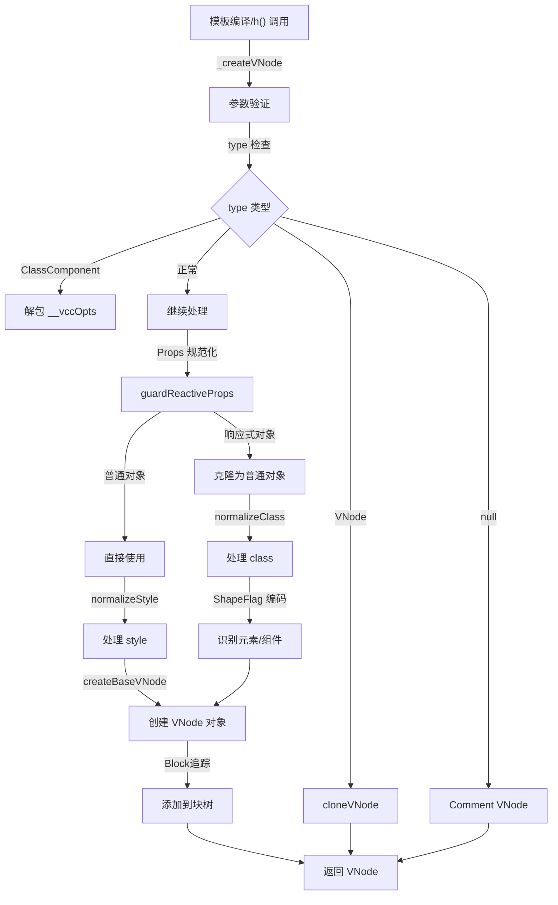

# createVNode 调用逻辑梳理

## 核心概述

`createVNode` 是 Vue 3 中**最核心的虚拟 DOM 创建函数**。它负责：
1. 接收组件/元素定义和属性
2. 进行类型判断、属性规范化
3. 创建 VNode 对象并追踪到块树中

## 函数签名

```typescript
function _createVNode(
  type: VNodeTypes | ClassComponent | typeof NULL_DYNAMIC_COMPONENT,
  props: (Data & VNodeProps) | null = null,
  children: unknown = null,
  patchFlag: number = 0,
  dynamicProps: string[] | null = null,
  isBlockNode = false,
): VNode
```

**发布形式：** 在 DEV 模式下使用 `createVNodeWithArgsTransform`，PROD 模式下使用 `_createVNode`

### 参数说明

| 参数 | 类型 | 说明 |
|------|------|------|
| `type` | VNodeTypes \| Component | 元素名（'div'）、组件对象或特殊类型（Fragment、Teleport） |
| `props` | Object \| null | 属性对象，包含 HTML 属性、class、style、事件监听器等 |
| `children` | unknown | 子元素，可以是字符串、VNode 数组或其他 |
| `patchFlag` | number | 补丁标志，指示哪些属性需要更新（编译器优化） |
| `dynamicProps` | string[] \| null | 动态属性名列表（哪些属性会变化） |
| `isBlockNode` | boolean | 是否是块树节点 |

## 完整执行流程

```
_createVNode(type, props, children, patchFlag, dynamicProps, isBlockNode)
  │
  ├─ 步骤 1: 类型检查和标准化
  │   ├─ 空类型检查 → Comment VNode
  │   ├─ VNode 检查 → cloneVNode
  │   ├─ ClassComponent 检查 → 解包 __vccOpts
  │   └─ 兼容性转换
  │
  ├─ 步骤 2: Props 规范化
  │   ├─ 响应式保护 (guardReactiveProps)
  │   ├─ class 处理 (normalizeClass)
  │   ├─ style 处理 (normalizeStyle)
  │   └─ 指令提取
  │
  ├─ 步骤 3: ShapeFlag 编码
  │   ├─ 识别元素类型
  │   ├─ 识别组件类型
  │   └─ 编码为位标志
  │
  ├─ 步骤 4: 创建基础 VNode
  │   ├─ 调用 createBaseVNode
  │   ├─ 处理 children 规范化
  │   ├─ 追踪到块树
  │   └─ 返回 VNode 对象
  │
  └─ 返回 VNode
```

## 详细流程分析

### 步骤 1: 类型检查和标准化

#### 1.1 处理空类型

```typescript
if (!type || type === NULL_DYNAMIC_COMPONENT) {
  if (__DEV__ && !type) {
    warn(`Invalid vnode type when creating vnode: ${type}.`)
  }
  type = Comment  // 转换为 Comment VNode
}
```

**场景：**
```javascript
createVNode(null)           // → Comment VNode
createVNode(undefined)      // → Comment VNode (开发模式警告)
createVNode(someVar)        // someVar 为 null 时变为 Comment
```

#### 1.2 处理 VNode 类型（递归情况）

```typescript
if (isVNode(type)) {
  // 当 type 本身是 VNode 时（如 <component :is="vnode"/>）
  const cloned = cloneVNode(type, props, true /* mergeRef: true */)
  if (children) {
    normalizeChildren(cloned, children)
  }
  // 追踪到块树...
  cloned.patchFlag = PatchFlags.BAIL
  return cloned
}
```

**场景：**
```javascript
const componentVNode = createVNode(MyComponent)
// 重新渲染这个 VNode
createVNode(componentVNode, { newProps: true })
// → 克隆原 VNode，合并新 props
```

**关键点：**
- 设置 `PatchFlags.BAIL` 表示需要完整比对
- `mergeRef: true` 支持多个 ref 的合并

#### 1.3 处理 ClassComponent

```typescript
if (isClassComponent(type)) {
  type = type.__vccOpts  // 解包类组件的选项
}
```

**场景：**
```javascript
class MyComponent extends Vue {
  render() { return h('div') }
}
// ClassComponent 被转换为普通组件对象
```

#### 1.4 兼容性转换

```typescript
if (__COMPAT__) {
  type = convertLegacyComponent(type, currentRenderingInstance)
}
```

**说明：** Vue 2 兼容模式下转换旧风格组件

### 步骤 2: Props 规范化

#### 2.1 响应式保护

```typescript
if (props) {
  // 克隆响应式或代理对象为普通对象
  props = guardReactiveProps(props)!

  let { class: klass, style } = props
  // ...后续处理
}
```

**为什么需要？**
- 避免直接修改响应式对象
- 响应式对象的 setter 会被触发（无意的副作用）
- 克隆后可以安全地进行规范化处理

**详细流程：**
```typescript
function guardReactiveProps(props) {
  if (!props) return null
  // 检查是 proxy 或内部对象，则克隆
  return isProxy(props) || isInternalObject(props)
    ? extend({}, props)
    : props
}
```

#### 2.2 class 处理

```typescript
let { class: klass, style } = props
if (klass && !isString(klass)) {
  props.class = normalizeClass(klass)
}
```

**处理的类型：**
```javascript
// 对象形式
{ class: { active: true, disabled: false } }
// → "active disabled"

// 数组形式
{ class: ['active', { 'disabled': false }] }
// → "active"

// 字符串形式（已是字符串，不处理）
{ class: 'active disabled' }
// → 'active disabled' (保持不变)
```

**normalizeClass 实现：**
```typescript
export function normalizeClass(value: unknown): string {
  let res = ''
  if (isString(value)) {
    res = value
  } else if (isArray(value)) {
    for (let i = 0; i < value.length; i++) {
      const normalized = normalizeClass(value[i])
      if (normalized) {
        res += normalized + ' '
      }
    }
  } else if (isObject(value)) {
    for (const name in value) {
      if (value[name]) {
        res += name + ' '
      }
    }
  }
  return res.trim()
}
```

#### 2.3 style 处理

```typescript
if (isObject(style)) {
  // 响应式 style 也需要额外克隆
  if (isProxy(style) && !isArray(style)) {
    style = extend({}, style)  // 再次克隆嵌套的 style
  }
  props.style = normalizeStyle(style)
}
```

**处理的类型：**
```javascript
// 对象形式
{ style: { color: 'red', fontSize: '14px' } }
// → { color: 'red', fontSize: '14px' }

// 字符串形式
{ style: 'color: red; font-size: 14px' }
// → 'color: red; font-size: 14px' (保持不变)

// 数组形式（合并多个对象）
{ style: [{ color: 'red' }, { fontSize: '14px' }] }
// → { color: 'red', fontSize: '14px' }
```

**normalizeStyle 实现：**
```typescript
export function normalizeStyle(value: unknown) {
  if (isArray(value)) {
    const res = {}
    for (let i = 0; i < value.length; i++) {
      const item = value[i]
      const normalized = isString(item)
        ? parseStringStyle(item)
        : (normalizeStyle(item) as NormalizedStyle)
      if (normalized) {
        for (const key in normalized) {
          res[key] = normalized[key]
        }
      }
    }
    return res
  } else if (isString(value) || isObject(value)) {
    return value
  }
}
```

### 步骤 3: ShapeFlag 编码

```typescript
const shapeFlag = isString(type)
  ? ShapeFlags.ELEMENT                    // 'div', 'span' 等
  : __FEATURE_SUSPENSE__ && isSuspense(type)
    ? ShapeFlags.SUSPENSE                 // Suspense 组件
    : isTeleport(type)
      ? ShapeFlags.TELEPORT               // Teleport 组件
      : isObject(type)
        ? ShapeFlags.STATEFUL_COMPONENT   // 对象组件
        : isFunction(type)
          ? ShapeFlags.FUNCTIONAL_COMPONENT  // 函数组件
          : 0
```

**ShapeFlags 值：**
```typescript
const ShapeFlags = {
  ELEMENT: 1,                    // 001
  FUNCTIONAL_COMPONENT: 1 << 1,  // 010
  STATEFUL_COMPONENT: 1 << 2,    // 100
  TEXT_CHILDREN: 1 << 3,         // 1000
  ARRAY_CHILDREN: 1 << 4,        // 10000
  SLOTS_CHILDREN: 1 << 5,        // 100000
  TELEPORT: 1 << 6,              // 1000000
  SUSPENSE: 1 << 7,              // 10000000
  // ...
}
```

**性能优势：** 使用位运算判断类型比 instanceof 或 typeof 快

#### 3.1 开发模式警告

```typescript
if (__DEV__ && shapeFlag & ShapeFlags.STATEFUL_COMPONENT && isProxy(type)) {
  type = toRaw(type)
  warn(
    `Vue received a Component that was made a reactive object. This can ` +
      `lead to unnecessary performance overhead and should be avoided by ` +
      `marking the component with \`markRaw\` or using \`shallowRef\` ` +
      `instead of \`ref\`.`,
  )
}
```

**提示：** 组件对象不应该被 reactive 包装

### 步骤 4: 创建基础 VNode

```typescript
return createBaseVNode(
  type,
  props,
  children,
  patchFlag,
  dynamicProps,
  shapeFlag,
  isBlockNode,
  true,  // needFullChildrenNormalization
)
```

#### 4.1 createBaseVNode 内部

```typescript
function createBaseVNode(
  type,
  props = null,
  children = null,
  patchFlag = 0,
  dynamicProps = null,
  shapeFlag = type === Fragment ? 0 : ShapeFlags.ELEMENT,
  isBlockNode = false,
  needFullChildrenNormalization = false,
): VNode {
  const vnode = {
    __v_isVNode: true,
    __v_skip: true,
    type,
    props,
    key: props && normalizeKey(props),
    ref: props && normalizeRef(props),
    scopeId: currentScopeId,
    slotScopeIds: null,
    children,
    component: null,
    suspense: null,
    ssContent: null,
    ssFallback: null,
    dirs: null,
    transition: null,
    el: null,
    anchor: null,
    target: null,
    targetStart: null,
    targetAnchor: null,
    staticCount: 0,
    shapeFlag,
    patchFlag,
    dynamicProps,
    dynamicChildren: null,
    appContext: null,
    ctx: currentRenderingInstance,
  } as VNode
```

**VNode 属性说明：**

| 属性 | 作用 |
|------|------|
| `__v_isVNode` | 标记为 VNode 对象 |
| `__v_skip` | 跳过 reactivity 代理 |
| `type` | 元素名或组件 |
| `props` | 属性对象 |
| `key` | 列表 key（用于 diff） |
| `ref` | ref 引用 |
| `children` | 子节点 |
| `el` | 对应的真实 DOM 节点 |
| `component` | 组件实例（渲染时填充） |
| `shapeFlag` | 类型标志 |
| `patchFlag` | 更新标志 |
| `dynamicProps` | 动态属性列表 |

#### 4.2 children 规范化

```typescript
if (needFullChildrenNormalization) {
  normalizeChildren(vnode, children)
  if (__FEATURE_SUSPENSE__ && shapeFlag & ShapeFlags.SUSPENSE) {
    (type as typeof SuspenseImpl).normalize(vnode)
  }
} else if (children) {
  // 编译器优化：只在必要时规范化
  vnode.shapeFlag |= isString(children)
    ? ShapeFlags.TEXT_CHILDREN
    : ShapeFlags.ARRAY_CHILDREN
}
```

**children 规范化类型：**
```typescript
enum ShapeFlags {
  TEXT_CHILDREN = 1 << 3,      // '文本'
  ARRAY_CHILDREN = 1 << 4,     // [vnode, vnode, ...]
  SLOTS_CHILDREN = 1 << 5,     // 插槽
}
```

#### 4.3 块树追踪

```typescript
if (
  isBlockTreeEnabled > 0 &&
  !isBlockNode &&
  currentBlock &&
  (vnode.patchFlag > 0 || shapeFlag & ShapeFlags.COMPONENT) &&
  vnode.patchFlag !== PatchFlags.NEED_HYDRATION
) {
  currentBlock.push(vnode)  // 追踪到当前块
}
```

**作用：** 编译器优化，快速找到需要更新的节点

#### 4.4 兼容性处理

```typescript
if (__COMPAT__) {
  convertLegacyVModelProps(vnode)
  defineLegacyVNodeProperties(vnode)
}
```

## 调用场景

### 场景 1: 编译的模板

```vue
<template>
  <div class="container" :style="styles">
    <span>Hello</span>
  </div>
</template>
```

**编译后的代码：**
```javascript
import { createVNode as _createVNode, Fragment as _Fragment } from 'vue'

export function render(_ctx, _cache, $props, $setup, $data, $options) {
  return _createVNode('div', {
    class: 'container',
    style: _ctx.styles,
  }, [
    _createVNode('span', null, 'Hello')
  ])
}
```

### 场景 2: h() 函数（手写渲染函数）

```javascript
import { h } from 'vue'

export default {
  render() {
    return h('div', {
      class: { active: this.isActive },
      style: { color: this.color }
    }, [
      h('span', 'Hello')
    ])
  }
}
```

### 场景 3: 动态组件

```javascript
createVNode(
  this.componentType,  // 动态决定的组件
  { props: true },
  slots.default
)
```

### 场景 4: 特殊类型

```javascript
// Fragment（多根节点）
createVNode(Fragment, null, [
  createVNode('div', '1'),
  createVNode('div', '2'),
])

// Teleport（传送门）
createVNode(Teleport, { to: '#modal' }, [
  createVNode('div', 'Modal Content')
])

// Suspense（异步组件包装）
createVNode(Suspense, null, {
  default: () => createVNode(AsyncComponent),
  fallback: () => createVNode('div', 'Loading...')
})
```

## 优化机制

### 1. 编译器标记

```javascript
// 编译器分析哪些属性会变化
createVNode('div',
  { id: dynamicId, class: 'static' },
  content,
  PatchFlags.PROPS,           // 只有 props 可能变化
  ['id']                      // 只有 id 这个 prop 变化
)
```

### 2. Block Tree

```javascript
// 模板中的每个块都被追踪
// 更新时只需要比对块内的动态节点，不需要完整树遍历
// 性能提升 3-5 倍
```

### 3. 静态提升

```javascript
// 编译器把静态节点提升到作用域外
const _hoisted_1 = createVNode('div', null, 'Static Content')

export function render() {
  return _hoisted_1  // 复用同一个 VNode
}
```

## 性能特点

| 操作 | 耗时 | 优化方式 |
|------|------|---------|
| 类型检查 | O(1) | 位运算 + 短路判断 |
| Props 规范化 | O(n) | 只在必要时进行 |
| Children 规范化 | O(m) | 延迟规范化 |
| Block 追踪 | O(1) | 数组 push |
| VNode 创建 | O(1) | 对象字面量 |

## 调用关系图



## 总结

createVNode 的执行逻辑包括四个主要阶段：

1. **类型检查** - 处理各种 type 的情况
2. **Props 规范化** - class、style、响应式保护
3. **ShapeFlag 编码** - 高效的类型标记
4. **VNode 创建** - 构建虚拟节点并追踪到块树

每个阶段都经过精心优化，确保创建 VNode 的性能开销最小化。
