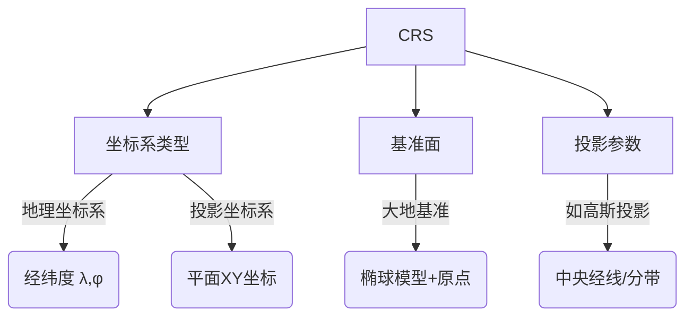

# 地理坐标系统

地理坐标系统（Geographic Coordinate System，简称 GCS） 是用于定义地球表面任意点位置的基本参考框架。它通过角度单位（经度和纬度）
来描述位置，是空间定位的基础。以下是深入解析：

## 核心概念

1. 球面坐标系：

- 地理坐标系将地球视为一个规则的旋转椭球体（接近真实地球的不规则形状）。
- 其坐标值用经纬度（Longitude, Latitude） 表示：
  - 经度（λ）：以本初子午线（0°经线） 为基准，向东为东经（0°~180°E），向西为西经（0°~180°W）。
  - 纬度（φ）：以赤道（0°纬线） 为基准，向北为北纬（0°~90°N），向南为南纬（0°~90°S）。

2. 单位：

- 经纬度以角度单位表示（度°、分′、秒″，或十进制小数度）。
- 不是线性距离单位（如米）。1°经度的实际距离在赤道约111km，在极地为0；1°纬度距离恒定为约111km。
- 大地基准面（Datum）：
  - 地理坐标系必须绑定一个“大地基准面”，用于定义：
    - 地球椭球的形状（长半轴、扁率）；
    - 椭球与地球真实质心/表面的位置关系（原点偏移）。

3. 常见基准面举例：

- WGS84：全球卫星定位（GPS）使用的基准面（地心）；
- CGCS2000：中国国家坐标系基准面（地心）；
- 北京54、西安80：中国旧坐标系的区域基准面（局部参考）。

4. 为何需要地理坐标系？

- 统一定位语言：
  - 提供全球通用的“地理地址”（如：北京天安门≈ 116.397°E, 39.909°N）。
- 空间数据存储基础：
  - 遥感影像、GPS轨迹、地理边界等原始数据通常以经纬度存储。
- 投影坐标的源头：
  - 所有平面地图（如高斯投影、墨卡托投影）均由地理坐标系数学投影转换而来

## EPSG

EPSG（通常读作 "E-P-S-G"）是一个全球性的坐标参考系统数据库及其标准编码体系的名称。它最初由欧洲石油测绘组 (European
Petroleum Survey Group) 于 1980 年代建立并维护，该组织后来解散。现在，其数据集由国际OGC（开放地理空间联盟） 下属的 EPSG
Geodetic Parameter Dataset 工作组维护和发布。

简单来说，EPSG 是一套赋予全球各地不同坐标系唯一标准编号的系统。

### EPSG代码解释

例如：CGCS2000 / 3-degree Gauss-Kruger CM 120E

1. CGCS2000

- 全称： China Geodetic Coordinate System 2000 (2000 国家大地坐标系)
- 含义： 这是中国官方于2008年开始正式启用的、基于现代卫星测量技术建立的全国统一大地坐标系。
- 基准： 基于地球质心，是一个地心、动态的坐标系（参考框架）。
- 参考椭球： CGCS2000椭球（长半轴 a ≈ 6378137.0 米，扁率倒数 f⁻¹ ≈ 298.257222101）。

2. 3-degree Gauss-Kruger

- 全称： Three-degree Gauss-Kruger Grid (3度分带高斯-克吕格格网)
- 含义： 指的是中国采用的高斯-克吕格投影 (Gauss-Krüger Projection) 的3度分带方案。
- 投影性质： 是一种横轴墨卡托投影 (Transverse Mercator Projection)。其特点是：
  - 经线投影后为曲线。
  - 纬线投影后为曲线。
  - 中央经线 (Central Meridian, CM) 投影后为直线，且长度比保持为1（没有变形）。
  - 中央经线两侧的变形：距离中央经线越远，长度变形越大。
  - 分带目的：为了控制投影变形，将全球或全国按经度差划分为一系列狭窄的投影带（每条带宽 3 度），每个带都独立进行投影并建立自己的平面直角坐标系统（x,
    y）。
  - 3度分带： 从东经 1.5° 开始，自西向东每隔 3°
    划分一个投影带（第1带的中央经线是东经3°，第2带是东经6°，...第n带的中央经线是东经(3n)°）。
- X、Y坐标（投影坐标）：
  - Y坐标 (东坐标 E)：
    为避免横坐标为负值，规定将每个投影带的纵坐标轴向西平移500公里。因此，投影后的横坐标值为：带内自然坐标值 (m) + 500, 000
    m。
  - X坐标 (北坐标 N)： 表示该点距离赤道的距离（以米为单位）。在赤道以北为正。

3. CM 120E

- CM： Central Meridian 的缩写，即中央经线。
- 120E： 东经120度。
- 含义： 该坐标参考系（投影坐标系）是专门为 中央经线为东经120° 的3度投影带 建立的。
  - 东经120°是哪个投影带的中央经线？根据中国使用的3度分带规则，带的带号与中央经线的关系是：带号 (N) = 中央经线经度 / 3。
  - 所以 120° / 3 = 40。这表示东经120°是第40带的中央经线。
  - 这个投影带的经度范围是：(带号 _ 3°) ± 1.5°，即 (40 _ 3°) ± 1.5°= 东经118.5°至东经121.5°。
  - 覆盖区域： 该投影带大致覆盖中国东部沿海地区，包括山东、江苏、浙江、上海、福建、台湾（大部分） 等省市的部分或全部区域（实际覆盖范围需结合纬度看）。
  - 总结：CGCS2000 / 3-degree Gauss-Kruger CM 120E 是什么？
  - 这是一个投影坐标参考系 (Projected Coordinate Reference System, Projected CRS)，其具体定义是：

## 坐标参考系统

`CRS` 是 **C**oordinate **R**eference **S**ystem 的缩写，中文译为**坐标参考系统**。它是地理空间数据定位的**基准框架**
，定义了坐标数值如何对应真实地球位置。

### 核心作用

| **功能**         | **说明**                                          |
| ---------------- | ------------------------------------------------- |
| **空间定位**     | 确定地理对象（点/线/面）在地球表面的精确位置      |
| **数据对齐**     | 使不同来源的地理数据能精确叠加（如卫星图+道路网） |
| **坐标转换基础** | 支持地理坐标系(GCS)与投影坐标系(PCS)的相互转换    |

1. CRS = 空间数据的“定位语言”

如同GPS需要知道经纬度（GCS）或地图网格坐标（PCS）才能精确定位。

2. CRS的核心三元组

### 实际应用场景

- 当使用 CGCS2000 / 3-degree Gauss-Kruger CM 120E时：
  - 类型 = 投影坐标系（PCS）
  - 基准 = CGCS2000
  - 参数 = 高斯投影，中央经线120°，3°分带
  - EPSG编码 = 4549
