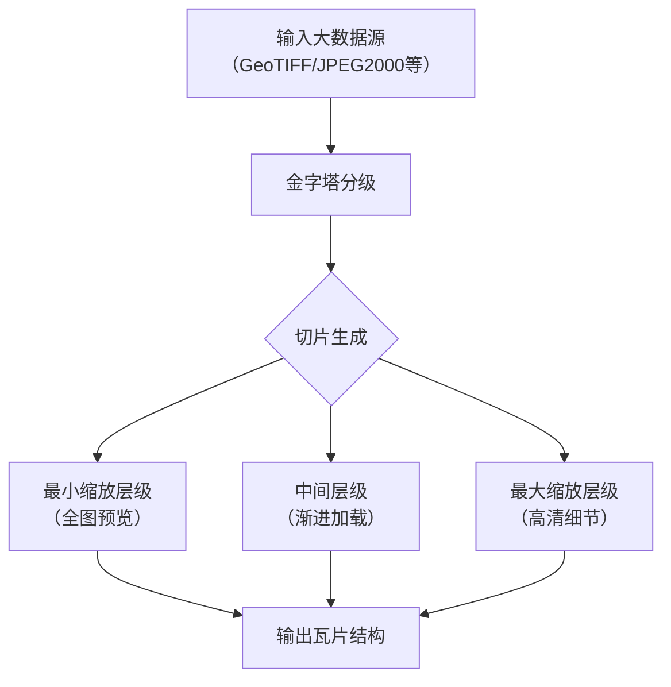

# tif切分

## gdal2tiles

- gdal2tiles是一个命令行工具，属于GDAL库的一部分。
- 它的作用是将大型栅格图像（如卫星影像、地图）切片成小图块（tiles），以便用于网络地图服务（如类似谷歌地图的瓦片地图）。
- 这些切片遵循标准的瓦片金字塔结构（不同缩放级别），可以被Leaflet、OpenLayers等JavaScript库调用。
- 它支持多种输出格式（PNG/JPEG）和瓦片标准（TMS、Google Maps等）。



### 瓦片组织方式（遵循TMS标准）

{z}/{x}/{y}.png # z=缩放级别, x=列号, y=行号

示例：tiles/14/8623/12345.png

### 常用命令

1. 查看tif文件信息

```shell
gdalinfo your_input_file.tif
```

- 查看输出中是否有Coordinate System is:部分。如果没有，说明SRS确实缺失。
- 如果该部分存在但显示为LOCAL_CS["Unknown"]或类似内容，同样表示SRS未知。

2. 坐标参考系转换

- 情况A：已知正确的SRS（例如EPSG编码）

使用gdal_translate或gdalwarp重新设置SRS：

```shell
gdal_translate -a_srs EPSG:4326 your_input_file.tif output_with_srs.tif
```

将EPSG:4326替换为你的文件实际使用的坐标系（如EPSG:3857等）。

- 情况B：SRS信息存在但格式不标准

尝试使用gdalwarp重新投影到一个已知的SRS（此步骤会进行重投影）：

```shell
gdalwarp -t_srs EPSG:3857 your_input_file.tif output_reprojected.tif
```

情况C：完全缺失SRS，但你知道其坐标系

使用gdal_edit.py直接修改原文件的元数据（不会重采样，仅修改元数据）：

```shell
gdal_edit.py -a_srs EPSG:4326 your_input_file.tif
```

注意：此命令直接修改原文件，建议先备份。

3. 输出瓦片

```shell
gdal2tiles --tiledriver=WEBP --webp-quality=85 --resampling=bilinear --processes=8 --no-kml --exclude --zoom=0-23 ./your_file_name.tif ./out_dir
```

对于大疆无人机拍摄的正摄影像，执行以下命令：

### 公司内部用

1. 修复tif参考坐标系

```shell
gdal_edit.py -a_srs EPSG:4549 cs_DOM.tif
```

2. 输出webp瓦片

```shell
gdal2tiles --s_srs EPSG:4549 --profile mercator --tiledriver=WEBP --xyz --webp-quality=85 --resampling=bilinear --processes=8 --no-kml --exclude --zoom=0-23 ./cs_DOM.tif ./output_webp
```

:::warning
在使用上述命令时，必须保证`.prj`、`.tfw`文件与tif文件名称保持一致

- `.prj`记录tif文件的坐标参考系
- `.tfw`记录tif文件的边界

:::
