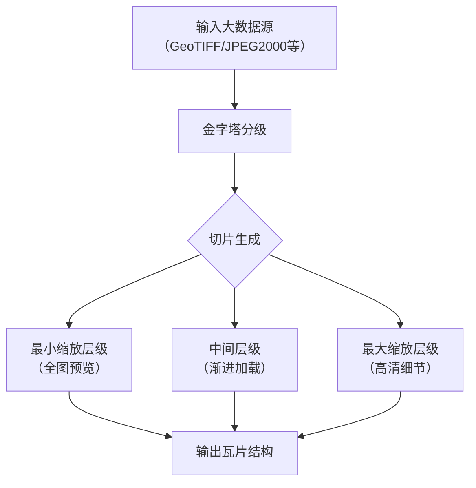

# tif切分

将tif格式文件切分为瓦片，一个完整的tif文件应包含：

- .prj：包含tif文件的参考坐标系信息
- .tfw：包含tif文件的在参考坐标系中的坐标范围，围成一个矩形

:::info

1. .prj文件参考：

**PROJCS["CGCS2000 / 3-degree Gauss-Kruger CM 120E"**,GEOGCS["China Geodetic Coordinate System 2000",DATUM["China_2000"
,SPHEROID["CGCS2000",6378137,298.257222101,AUTHORITY["EPSG","1024"]],AUTHORITY["EPSG","1043"]],PRIMEM["Greenwich"
,0,AUTHORITY["EPSG","8901"]],UNIT["degree",0.0174532925199433,AUTHORITY["EPSG","9122"]],AUTHORITY["EPSG","4490"]]
,PROJECTION["Transverse_Mercator"],PARAMETER["latitude_of_origin",0],PARAMETER["central_meridian",120]
,PARAMETER["scale_factor",1],PARAMETER["false_easting",500000],PARAMETER["false_northing",0],UNIT["metre"
,1,AUTHORITY["EPSG","9001"]],AXIS["Northing",NORTH],AXIS["Easting",EAST],AUTHORITY["EPSG","4549"]]

其中加粗部分标识该tif文件的参考坐标系，可以在通过[该网站](https://epsg.ruiduobao.com/)查询对应的EPSG代码，方便后续工具处理

2. .tfw文件参考：

0.100000
0.0000000000
0.0000000000
-0.100000
497162.017651
3351101.328192
:::

## gdal2tiles

- gdal2tiles是一个命令行工具，属于GDAL库的一部分。
- 它的作用是将大型栅格图像（如卫星影像、地图）切片成小图块（tiles），以便用于网络地图服务（如类似谷歌地图的瓦片地图）。
- 这些切片遵循标准的瓦片金字塔结构（不同缩放级别），可以被Leaflet、OpenLayers等JavaScript库调用。
- 它支持多种输出格式（PNG/JPEG）和瓦片标准（TMS、Google Maps等）。



### 瓦片组织方式（遵循TMS标准）

{z}/{x}/{y}.png # z=缩放级别, x=列号, y=行号

示例：tiles/14/8623/12345.png

### 常用命令

1. 查看tif文件信息

```shell
gdalinfo your_input_file.tif
```


- 查看输出中是否有Coordinate System is:部分。如果没有，说明SRS（空间参考系统：Spatial Reference System，SRS）确实缺失。
- 如果该部分存在但显示为LOCAL_CS["Unknown"]或类似内容，同样表示SRS未知。

:::info
完整的信息参考样例：

```shell
Driver: GTiff/GeoTIFF
Files: cs_DOM.tif
Size is 8394, 6285
Coordinate System is:
PROJCRS["CGCS2000 / 3-degree Gauss-Kruger CM 120E",
BASEGEOGCRS["China Geodetic Coordinate System 2000",
DATUM["China 2000",
ELLIPSOID["CGCS2000",6378137,298.257222101,
LENGTHUNIT["metre",1]]],
PRIMEM["Greenwich",0,
ANGLEUNIT["degree",0.0174532925199433]],
ID["EPSG",4490]],
CONVERSION["3-degree Gauss-Kruger CM 120E",
METHOD["Transverse Mercator",
ID["EPSG",9807]],
PARAMETER["Latitude of natural origin",0,
ANGLEUNIT["degree",0.0174532925199433],
ID["EPSG",8801]],
PARAMETER["Longitude of natural origin",120,
ANGLEUNIT["degree",0.0174532925199433],
ID["EPSG",8802]],
PARAMETER["Scale factor at natural origin",1,
SCALEUNIT["unity",1],
ID["EPSG",8805]],
PARAMETER["False easting",500000,
LENGTHUNIT["metre",1],
ID["EPSG",8806]],
PARAMETER["False northing",0,
LENGTHUNIT["metre",1],
ID["EPSG",8807]]],
CS[Cartesian,2],
AXIS["northing (X)",north,
ORDER[1],
LENGTHUNIT["metre",1]],
AXIS["easting (Y)",east,
ORDER[2],
LENGTHUNIT["metre",1]],
USAGE[
SCOPE["Cadastre, engineering survey, topographic mapping (large scale)."],
AREA["China - onshore between 118°30'E and 121°30'E."],
BBOX[24.43,118.5,53.33,121.5]],
ID["EPSG",4549]]
Data axis to CRS axis mapping: 2,1
Origin = (497161.967651000013575,3351101.378191999625415)
Pixel Size = (0.100000000000000,-0.100000000000000)
Metadata:
AREA_OR_POINT=Area
Image Structure Metadata:
INTERLEAVE=PIXEL
Corner Coordinates:
Upper Left  (  497161.968, 3351101.378) (119d58'13.81"E, 30d16'46.32"N)
Lower Left  (  497161.968, 3350472.878) (119d58'13.82"E, 30d16'25.91"N)
Upper Right (  498001.368, 3351101.378) (119d58'45.22"E, 30d16'46.33"N)
Lower Right (  498001.368, 3350472.878) (119d58'45.22"E, 30d16'25.92"N)
Center      (  497581.668, 3350787.128) (119d58'29.52"E, 30d16'36.12"N)
Band 1 Block=512x512 Type=Byte, ColorInterp=Red
Band 2 Block=512x512 Type=Byte, ColorInterp=Green
Band 3 Block=512x512 Type=Byte, ColorInterp=Blue

```

缺失信息参考样例：

```shell
Driver: GTiff/GeoTIFF
Files: origin_backup.tif
Size is 8394, 6285
Image Structure Metadata:
  INTERLEAVE=PIXEL
Corner Coordinates:
Upper Left  (    0.0,    0.0)
Lower Left  (    0.0, 6285.0)
Upper Right ( 8394.0,    0.0)
Lower Right ( 8394.0, 6285.0)
Center      ( 4197.0, 3142.5)
Band 1 Block=512x512 Type=Byte, ColorInterp=Red
Band 2 Block=512x512 Type=Byte, ColorInterp=Green
Band 3 Block=512x512 Type=Byte, ColorInterp=Blue
```

:::

2. 坐标参考系转换

- 情况A：已知正确的SRS（例如EPSG编码）

使用gdal_translate或gdalwarp重新设置SRS：

```shell
gdal_translate -a_srs EPSG:4326 your_input_file.tif output_with_srs.tif
```

将EPSG:4326替换为你的文件实际使用的坐标系（如EPSG:3857等）。

- 情况B：SRS信息存在但格式不标准

尝试使用gdalwarp重新投影到一个已知的SRS（此步骤会进行重投影）：

```shell
gdalwarp -t_srs EPSG:3857 your_input_file.tif output_reprojected.tif
```

情况C：完全缺失SRS，但你知道其坐标系

使用gdal_edit.py直接修改原文件的元数据（不会重采样，仅修改元数据）：

```shell
gdal_edit.py -a_srs EPSG:4326 your_input_file.tif
```

注意：此命令直接修改原文件，建议先备份。

3. 输出瓦片

```shell
gdal2tiles --tiledriver=WEBP --webp-quality=85 --resampling=bilinear --processes=8 --no-kml --exclude --zoom=0-23 ./your_file_name.tif ./out_dir
```

对于大疆无人机拍摄的正摄影像，执行以下命令：

### 公司内部用

1. 修复tif参考坐标系

```shell
gdal_edit.py -a_srs EPSG:4549 cs_DOM.tif
```

2. 输出webp瓦片

```shell
gdal2tiles --s_srs EPSG:4549 --profile mercator --tiledriver=WEBP --xyz --webp-quality=85 --resampling=bilinear --processes=8 --no-kml --exclude --zoom=0-23 ./cs_DOM.tif ./output_webp
```

:::warning
在使用上述命令时，必须保证`.prj`、`.tfw`文件与tif文件名称保持一致

- `.prj`记录tif文件的坐标参考系
- `.tfw`记录tif文件的边界

:::
