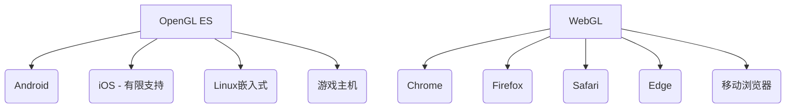

# 概念解释

- OpenGL：主要被认为是一个 API（一个应用程序编程接口OpenGL 提供了丰富的函数集，可用于处理图形和图像）。然而，OpenGL 本身并不是一个
  API，而仅仅是一个`规范`，由Khronos 集团开发和维护。
- opengl es
- WebGL
  - WebGL与OpenGL ES技术上的区别
    - OpenGL ES：应用层 (C/C++/Java/Kotlin/Swift) -> OpenGL ES API -> 设备驱动层 -> GPU硬件
    - WebGL：Web应用 (JavaScript) -> WebGL API -> 浏览器渲染引擎 -> 操作系统图形驱动 -> GPU硬件
  - 编程语言上的区别
    - OpenGL ES：使用GLSL编程
    - WebGL：支持JS、GLSL编程
  - 性能上的区别
    - OpenGL ES
      - 直接与硬件交互
      - 更低的开销
      - 支持多线程渲染
      - 可访问所有GPU功能
    - WebGL
      - 通过JavaScript执行
      - 受浏览器引擎限制
      - 单线程渲染（Worker有限支持）
      - 额外的内存拷贝开销
      - 限制：严格的资源限制（纹理尺寸/数量）、着色器长度限制、跨域纹理加载限制、无直接帧缓冲区访问、
        安全沙箱导致的性能损失

跨平台支持

## 渲染管线

1. 顶点着色器处理顶点:对传入的顶点信息进行处理,例如裁剪空间变换、平移、缩放、旋转等操作.
2. 图元装配:将顶点装配成基本图形的过程,即告诉OpenGL 如何将这几个点以什么样的形式组合起来（哪几个点为一组）.
3. 光栅化:
   逐个判断像素是否在图形内,同时对非顶点的位置进行插值处理,赋予每个像素其他的信息.因为一个像素不仅仅只有颜色信息,所以我们称其为“片元(
   Fragment)”.
4. 片段着色器着色:对光栅化后的片元进行着色处理,光照、材质等基本都是在片元着色器中完成的.
5. 测试 & 混合:包括深度测试（物体被遮挡的部分不被显示出来）、模板测试、混合（透明度值的混合）

参考：

【1】[OpenGL-3.3 规范](https://registry.khronos.org/OpenGL/specs/gl/glspec33.core.pdf)

【2】[OpenGL规范](https://registry.khronos.org/OpenGL/index_gl.php)

【3】[wiki#ASCII](https://zh.wikipedia.org/wiki/ASCII)

【4】[wiki#UTF-8](https://zh.wikipedia.org/wiki/UTF-8)
